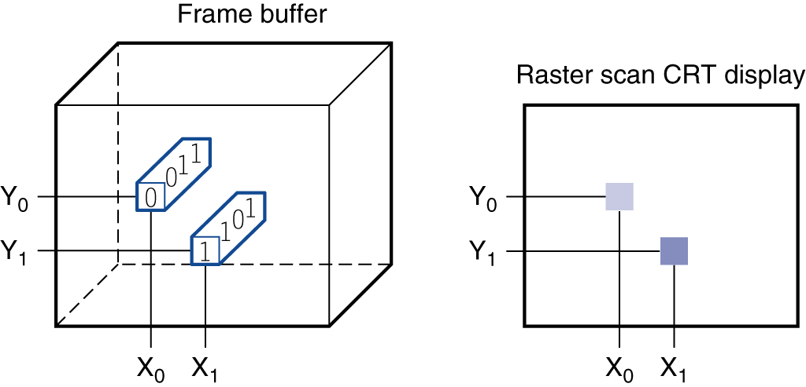
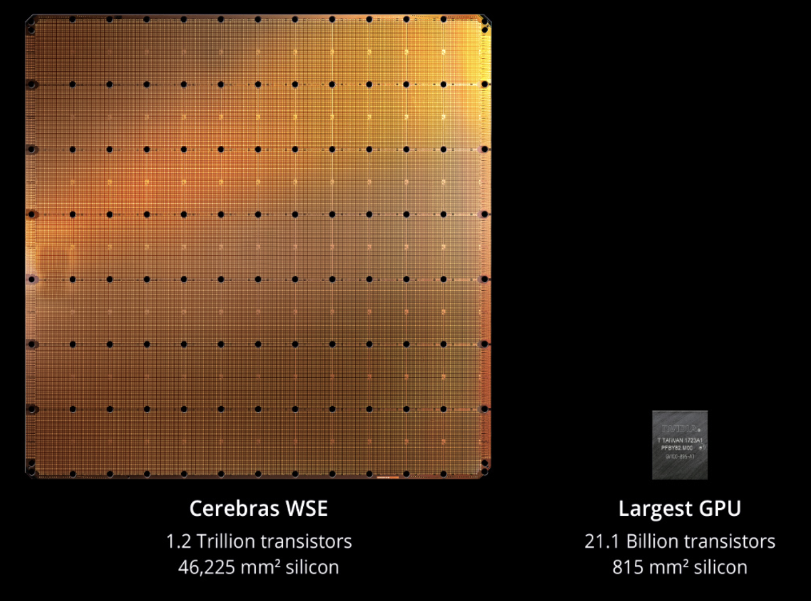
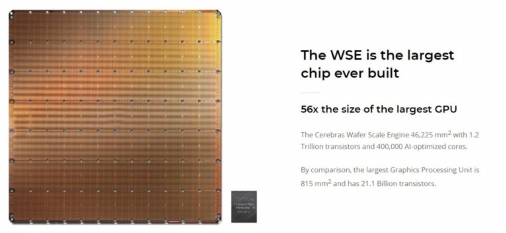
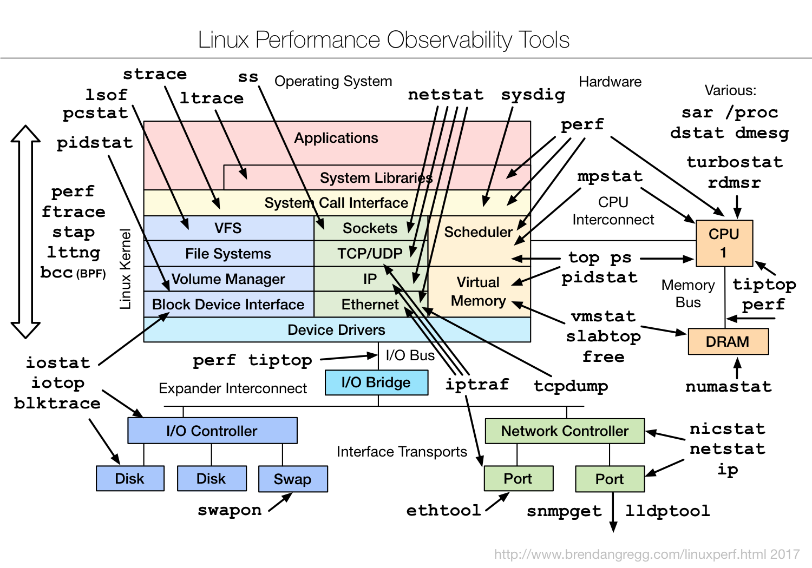

# Chapter 1

- [Chapter 1](CA_ch1.md)
- [Chapter 2](CA_ch2.md)
- [Chapter 3](CA_ch3.md)
- [Chapter 4](CA_ch4.md)
- [Chapter 5](CA_ch5.md)
- [Chapter 6](CA_ch6.md)

# Computer Abstractions and Technology

### The Computer Revolution

## §1\.1 Introduction

* Progress in computer technology
  * Underpinned by   __Moore’s Law __ 
  * Underpinned by  __domain\-specific accelerators__
* Makes novel applications feasible
  *  __Computers in automobiles__ 
  * Cell phones
  *  __Human genome project__ 
  * World Wide Web
  * Search Engines
* Computers are pervasive

### Classes of Computers

* Personal computers
  * General purpose\, variety of software
  * Subject to   __cost/performance__     __tradeoff__ 
* Server computers
  *  __Network__   based
  * High capacity\, performance\,   __reliability__ 
  * Range from small servers to building sized

* Supercomputers
  *  __High\-end__   scientific and engineering calculations
  * Highest capability but represent a small fraction of the overall computer market
* Embedded computers
  *  __Hidden__   as components of systems
  * Stringent power/performance/cost   __constraints__ 

### The PostPC Era

* Personal Mobile Device \(PMD\)
  * Battery operated
  * Connects to the Internet
  * Hundreds of dollars
  *  __Smart phones\, tablets\, electronic glasses__ 
* Cloud computing
  * Warehouse Scale Computers \(WSC\)
  * Software as a Service \(SaaS\)
  * Portion of software run on a PMD and a portion run in the Cloud
  *  __Amazon and Google__ 

### What You Will Learn

* How programs are translated into the   __machine language__ 
  * And how the hardware executes them
* The   __hardware/software interface__ 
* What determines   __program__     __performance__ 
  * And how it can be improved
* How   __hardware designers __  improve performance
* What is   __parallel processing__ 

### Understanding Performance

*  __Algorithm__ 
  * Determines number of operations executed
*  __Programming language\, compiler__  \,   __architecture__ 
  * Determine number of machine instructions executed per operation
*  __Processor and memory system__ 
  * Determine how fast instructions are executed
*  __I/O system __  \(including   __OS__  \)
  * Determines how fast I/O operations are executed

### Eight/Seven Great Ideas

Design for    _Moore’s Law?_ 

Use  _abstraction_  to simplify design

Make the  _common case fast_

Performance  _via_   _parallelism_

Performance  _via_   _pipelining_

Performance  _via_   _prediction_

_Hierarchy_  of memories

_Dependability_   _via_  redundancy

## §1\.2 Eight Great Ideas in Computer Architecture

### Below Your Program

* Application software
  * Written in high\-level language
*  __System software__ 
  * Compiler: translates HLL code to machine code
  * Operating System: service code
    * Handling input/output
    * Managing memory and storage
    * Scheduling tasks & sharing resources
*  __Hardware__ 
  * Processor\, memory\, I/O controllers

## §1\.3 Below Your Program

### Levels of Program Code

* High\-level language
  * Level of abstraction closer to problem domain
  * Provides for productivity and portability
* Assembly language
  * Textual representation of instructions
* Hardware representation
  * Binary digits \(bits\)
  * Encoded instructions and data

### Components of a Computer

## §1\.4 Under the Covers

* Same components forall kinds of computer
  * Desktop\, server\,embedded\,   _supercomputer_ 
* Input/output includes
  * User\-interface devices
    * Display\, keyboard\, mouse
  * Storage devices
    * Hard disk\, CD/DVD\, flash
  * Network adapters
    * For communicating with other computers

### Touchscreen

* PostPC device
* Supersedes keyboard and mouse
* Resistive and Capacitive types
  * Most tablets\, smart phones use capacitive
  * Capacitive allows multiple touches simultaneously

### Through the Looking Glass

* LCD screen: picture elements \(pixels\)
  * Mirrors content of frame buffer memory

### Opening the Box (A5)

Capacitive multitouch LCD screen

3\.8 V\, 25 Watt\-hour battery

### Inside the Processor (CPU)

*  __Datapath__  : performs operations on data
*  __Control__  : sequences datapath\, memory\, \.\.\.
*  __Cache__   memory
  * Small fast SRAM memory for immediate access to data

### Inside the Processor

Apple A5

### Abstractions

* Abstraction helps us deal with   __complexity__ 
  * Hide lower\-level detail
*  __Instruction set architecture \(ISA\)__ 
  * The hardware/software interface
*  __Application binary interface__    __ __    __\(ABI\)__ 
  * The ISA plus   __system software interface__ 
* Implementation
  * The   __details__   underlying and interface

### A Safe Place for Data

* Volatile main memory
  * Loses instructions and data when power off
*  __Non\-volatile__   secondary memory
  * Magnetic disk
  * Flash memory
  * Optical disk \(CDROM\, DVD\)

### Networks

Communication\, resource sharing\, nonlocal access

Local area network \(LAN\): Ethernet

Wide area network \(WAN\): the Internet

Wireless network: WiFi\, Bluetooth

### Technology Trends

* Electronics technology   __continues to evolve__ 
  * Increased capacity and performance
  * Reduced cost

## §1\.5 Technologies for Building Processors and Memory

| Year | Technology | Relative performance/cost |  |
| :-: | :-: | :-: | :-: |
| 1951 | Vacuum tube | 1 |  |
| 1965 | Transistor | 35 |  |
| 1975 | Integrated circuit \(IC\) | 900 |  |
| 1995 | Very large scale IC \(VLSI\) | 2\,400\,000 |  |
| 2013 | Ultra large scale IC | 250\,000\,000\,000 |  |

### Semiconductor Technology

* Silicon:  semiconductor
* Add materials to transform properties:
  * Conductors
  * Insulators
  * Switch

### Manufacturing ICs

Yield: proportion of working dies per wafer

### Intel Core i7 Wafer

300mm wafer\, 280 chips\, 32nm technology

Each chip is 20\.7 x 10\.5 mm

### Intel® Core 10th Gen

300mm wafer\, 506 chips\, 10nm technology

Each chip is 11\.4 x 10\.7 mm

### Integrated Circuit Cost

* Nonlinear relation to area and defect rate
  * Wafer cost and area are fixed
  * Defect rate determined by manufacturing process
  * Die area determined by architecture and circuit design

### Wafer-Scale Computer

https://www\.ithome\.com\.tw/news/132516

### Defining Performance (1/2)

## §1\.6 Performance

Which airplane has the best performance?

## §1\.6 Performance

Which airplane has the best performance?

### Response Time and Throughput

*  __Response time__ 
  * How long it takes to do a task
*  __Throughput__ 
  * Total work done per unit time
    * e\.g\.\, tasks/transactions/… per hour
* How are response time and throughput affected by
  * Replacing the processor with a faster version?
  * Adding more processors?
* We’ll focus on response time for now…

### Relative Performance

 __Define Performance = 1/Execution Time__ 

“X is  _n_  time faster than Y”

* Example: time taken to run a program
  * 10s on A\, 15s on B
  * Execution TimeB / Execution TimeA= 15s / 10s = 1\.5
  * So A is 1\.5 times faster than B

### Measuring Execution Time

*  __Elapsed time__ 
  * Total response time\, including all aspects
    * Processing\, I/O\, OS overhead\, idle time
  * Determines system performance
*  __CPU time__ 
  * Time spent processing a given job
    * Discounts I/O time\, other jobs’ shares
  * Comprises user CPU time and system CPU time
  * Different programs are affected differently by CPU and system performance

### Performance Monitoring Tools

### Intel Vtune Performance Analyzer

[https://software\.intel\.com/en\-us/videos/hpc\-applications\-need\-high\-performance\-analysis](https://software.intel.com/en-us/videos/hpc-applications-need-high-performance-analysis)

### CPU Clocking

Operation of digital hardware governed by a   __constant\-rate clock__ 

Data transferand computation

* Clock period: duration of a clock cycle
  * e\.g\.\, 250ps = 0\.25ns = 250×10–12s
* Clock frequency \(rate\): cycles per second
  * e\.g\.\, 4\.0GHz = 4000MHz = 4\.0×109Hz

### CPU Time

* Performance improved by
  * Reducing number of clock cycles
  * Increasing clock rate
  * Hardware designer must often trade off clock rate against cycle count

### CPU Time Example

* Computer A: 2GHz clock\, 10s CPU time
* Designing Computer B
  * Aim for 6s CPU time
  * Can do faster clock\, but causes 1\.2 × clock cycles
* How fast must Computer B clock be?

### Instruction Count and CPI

* Instruction Count for a program
  * Determined by program\, ISA and compiler
* Average cycles per instruction
  * Determined by CPU hardware
  * If different instructions have different CPI
    * Average CPI affected by instruction mix

### CPI Example

Computer A: Cycle Time = 250ps\, CPI = 2\.0

Computer B: Cycle Time = 500ps\, CPI = 1\.2

Same ISA

Which is faster\, and by how much?

### CPI in More Details

If different instruction classes take different numbers of cycles

Weighted average CPI

Relative frequency

### CPI Example

Alternative compiled code sequences using instructions in classes A\, B\, C

| Class | A | B | C |
| :-: | :-: | :-: | :-: |
| CPI for class | 1 | 2 | 3 |
| IC in sequence 1 | 2 | 1 | 2 |
| IC in sequence 2 | 4 | 1 | 1 |

* Sequence 1: IC = 5
  * Clock Cycles= 2×1 \+ 1×2 \+ 2×3= 10
  * Avg\. CPI = 10/5 = 2\.0
* Sequence 2: IC = 6
  * Clock Cycles= 4×1 \+ 1×2 \+ 1×3= 9
  * Avg\. CPI = 9/6 = 1\.5

### Performance Summary

* Performance depends on
  * Algorithm: affects IC\, possibly CPI
  * Programming language: affects IC\, CPI
  * Compiler: affects IC\, CPI
  * Instruction set architecture: affects IC\, CPI\, Tc

### Power Trends (~2012)

## §1\.7 The Power Wall

In CMOS IC technology

## §1\.7 The Power Wall

In CMOS IC technology

### Power Trends (~2024)

### Reducing Power

* Suppose a new CPU has
  * 85% of capacitive load of old CPU
  * 15% voltage and 15% frequency reduction
* The power wall
  * We can’t reduce voltage further
  * We can’t remove more heat
* How else can we improve performance?

### Uniprocessor Performance

## §1\.8 The Sea Change: The Switch to Multiprocessors

Constrained by power\, instruction\-level parallelism\, memory latency

### Multiprocessors

* Multicore microprocessors
  * More than one processor per chip
* Requires explicitly parallel programming
  * Compare with instruction level parallelism
    * Hardware executes multiple instructions at once
    * Hidden from the programmer
  * Hard to do
    * Programming for performance
    * Load balancing
    * Optimizing communication and synchronization

### SPEC CPU Benchmark

* Programs used to measure performance
  * Supposedly typical of actual workload
* Standard Performance Evaluation Corp \(SPEC\)
  * Develops benchmarks for CPU\, I/O\, Web\, …
* SPEC CPU2006
  * Elapsed time to execute a selection of programs
    * Negligible I/O\, so focuses on CPU performance
  * Normalize relative to reference machine
  * Summarize as geometric mean of performance ratios
    * CINT2006 \(integer\) and CFP2006 \(floating\-point\)

### CINT2006 for Intel Core i7 920

### SPECspeed 2017 Integer benchmarks on a1.8 GHz Intel Xeon E5-2650L

### SPEC Power Benchmark

* Power consumption of server at different workload levels
  * Performance: ssj\_ops/sec
  * Power: Watts \(Joules/sec\)

### SPECpower_ssj2008 for Xeon X5650

### Pitfall: Amdahl’s Law

Improving an aspect of a computer and expecting a proportional improvement in overall performance

## §1\.10 Fallacies and Pitfalls

* Example: multiply accounts for 80s/100s
  * How much improvement in multiply performance to get 5× overall?

Corollary: make the common case fast

### Fallacy: Low Power at Idle

* Look back at i7 power benchmark
  * At 100% load: 258W
  * At 50% load: 170W \(66%\)
  * At 10% load: 121W \(47%\)
* Google data center
  * Mostly operates at 10% – 50% load
  * At 100% load less than 1% of the time
* Consider designing processors to make power proportional to load

### Pitfall: MIPS as a Performance Metric

* MIPS: Millions of Instructions Per Second
  * Doesn’t account for
    * Differences in ISAs between computers
    * Differences in complexity between instructions
  * CPI varies between programs on a given CPU

### Concluding Remarks

* __Cost/performance is improving__
  * Due to underlying technology development
* __Hierarchical layers of abstraction__
  * In both hardware and software
* __Instruction set architecture__
  * The hardware/software interface
* __Execution time__ :
  * The best performance measure
*  __Power is a limiting factor__ 
  * Use parallelism to improve performance

## §1\.11 Concluding Remarks

### Ongoing Innovations

Exascale computing

Accelerators for deep learning

Reconfigurable computing

Neuromorphic computing

Quantum computing

 __Apple\, Google\, Facebook\, Amazon\, Microsoft – Which does not pay attention to computer architecture?__ 

### This Is an Engineering Course

* What does engineering mean?
  * Engineering principles\, and know\-hows
  * Research methodologies in science and engineering
* Improve core technologies to empower new applications
  * AI accelerators
* _We don’t make AI; we make AI better\!_
* _~ AI System Architect_

