# Chapter 2

- [Chapter 1](CA_ch1.md)
- [Chapter 2](CA_ch2.md)
- [Chapter 3](CA_ch3.md)
- [Chapter 4](CA_ch4.md)
- [Chapter 5](CA_ch5.md)
- [Chapter 6](CA_ch6.md)

# Instructions: Language of the Computer

### Instruction Set

## §2\.1 Introduction


* The repertoire of instructions of a computer
* Different computers have different instruction sets
  * But with many aspects in common
* Early computers had very simple instruction sets
  * Simplified implementation
* Many modern computers also have simple instruction sets

### The RISC-V Instruction Set

- Used as the example throughout the book
- Developed at UC Berkeley as open ISA
- Now managed by the RISC\-V Foundation \( _riscv\.org_ \)
- Typical of many modern ISAs
  - See RISC\-V Reference Data tear\-out card
- Similar ISAs have a large share of embedded core market
  - Applications in consumer electronics\, network/storage equipment\, cameras\, printers\, …

### Arithmetic Operations

- Add and subtract, three operands
  - Two sources and one destination
- add a, b, c  // a gets b + c
- All arithmetic operations have this form
- _Design Principle 1:_  Simplicity favors regularity
  - Regularity makes implementation simpler
  - Simplicity enables higher performance at lower cost

## §2\.2 Operations of the Computer Hardware

### Arithmetic Example

C code:

```c
f = (g + h) - (i + j);
```

Compiled RISC\-V code:

```assembly
add t0, g, h   // temp t0 = g + h
add t1, i, j   // temp t1 = i + j
sub f, t0, t1  // f = t0 - t1
```

### Register Operands

- Arithmetic instructions use registeroperands
- RISC\-V has a 32 × 64\-bit register file
  - Use for frequently accessed data
  - 64\-bit data is called a “doubleword”
    - 32 x 64\-bit general purpose registers x0 to x31
  - 32\-bit data is called a “word”
- _Design Principle 2:_  Smaller is faster
  - c\.f\. main memory: millions of locations

## §2\.3 Operands of the Computer Hardware

### RISC-V Registers

- `x0`: the constant value 0
- `x1`: return address
- `x2`: stack pointer
- `x3`: global pointer
- `x4`: thread pointer
- `x5` – `x7`, `x28` – `x31`: temporaries
- `x8`: frame pointer
- `x9`, `x18` – `x27`: saved registers
- `x10` – `x11`: function arguments/results
- `x12` – `x17`: function arguments

### Register Operand Example

- C code:

```c
f = (g + h) - (i + j);
```

- f\, …\, j in x19\, x20\, …\, x23
- Compiled RISC\-V code:

```assembly
add x5, x20, x21
add x6, x22, x23
sub x19, x5, x6
```

### Memory Operands

- Main memory used for composite data
  - Arrays\, structures\, dynamic data
- To apply arithmetic operations
  - Load values from memory into registers
  - Store result from register to memory
- Memory is byte addressed
  - Each address identifies an 8\-bit byte
- RISC\-V is Little Endian
  - Least\-significant byte at least address of a word
  - _c\.f\._  Big Endian: most\-significant byte at least address
- RISC\-V does not require words to be aligned in memory
  - Unlike some other ISAs

### Memory Operand Example

- C code:

```c
A[12] = h + A[8];
```

- h in x21\, base address of A in x22
- Compiled RISC\-V code:
  - Index 8 requires offset of 64
    - 8 bytes per doubleword

```assembly
ld   x9, 64(x22)
add  x9, x21, x9
sd   x9, 96(x22)
```

### Registers vs. Memory

- Registers are faster to access than memory
- Operating on memory data requires loads and stores
  - More instructions to be executed
- Compiler must use registers for variables as much as possible
  - Only spill to memory for less frequently used variables
  - Register optimization is important\!

### Immediate Operands

- Constant data specified in an instruction
- addi x22\, x22\, 4
- Make the common case fast
  - Small constants are common
  - Immediate operand avoids a load instruction

### Unsigned Binary Integers

Given an n\-bit number

## §2\.4 Signed and Unsigned Numbers

- Range: 0 to \+2n – 1
- Example
  - 0000 0000 … 0000 10112= 0 \+ … \+ 1×23 \+ 0×22 \+1×21 \+1×20= 0 \+ … \+ 8 \+ 0 \+ 2 \+ 1 = 1110
- Using 64 bits: 0 to \+18\,446\,774\,073\,709\,551\,615

### 2s-Complement Signed Integers

Given an n\-bit number

- Range: –2n – 1 to \+2n – 1 – 1
- Example
  - 1111 1111 … 1111 11002= –1×231 \+ 1×230 \+ … \+ 1×22 \+0×21 \+0×20= –2\,147\,483\,648 \+ 2\,147\,483\,644 = –410
- Using 64 bits: −9\,223\,372\,036\,854\,775\,808   to 9\,223\,372\,036\,854\,775\,807

- Bit 63 is sign bit
  - 1 for negative numbers
  - 0 for non\-negative numbers
- –\(–2n – 1\) can’t be represented
- Non\-negative numbers have the same unsigned and 2s\-complement representation
- Some specific numbers
  - 0: 0000 0000 … 0000
  - –1: 1111 1111 … 1111
  - Most\-negative: 1000 0000 … 0000
  - Most\-positive: 0111 1111 … 1111

### Signed Negation

- Complement and add 1
  - Complement means 1 → 0\, 0 → 1
- Example: negate \+2
  - \+2 = 0000 0000 … 0010two
  - –2 = 1111 1111 … 1101two \+ 1     = 1111 1111 … 1110two

### Sign Extension

- Representing a number using more bits
  - Preserve the numeric value
- Replicate the sign bit to the left
  - c\.f\. unsigned values: extend with 0s
- Examples: 8\-bit to 16\-bit
  - \+2: 0000 0010 => 0000 0000 0000 0010
  - –2: 1111 1110 => 1111 1111 1111 1110
- In RISC\-V instruction set
  - lb:  sign\-extend loaded byte
  - lbu: zero\-extend loaded byte

### Representing Instructions

- Instructions are encoded in binary
  - Called machine code
- RISC\-V instructions
  - Encoded as 32\-bit instruction words
  - Small number of formats encoding operation code \(opcode\)\, register numbers\, …
  - Regularity\!

## §2\.5 Representing Instructions in the Computer

### Hexadecimal

- Base 16
  - Compact representation of bit strings
  - 4 bits per hex digit

| 0 | 0000 | 4 | 0100 | 8 | 1000 | c | 1100 |
| :-: | :-: | :-: | :-: | :-: | :-: | :-: | :-: |
| 1 | 0001 | 5 | 0101 | 9 | 1001 | d | 1101 |
| 2 | 0010 | 6 | 0110 | a | 1010 | e | 1110 |
| 3 | 0011 | 7 | 0111 | b | 1011 | f | 1111 |

- Example: eca8 6420
  - 1110 1100 1010 1000 0110 0100 0010 0000

### RISC-V R-format Instructions

- Instruction fields
  - opcode: operation code
  - rd: destination register number
  - funct3: 3\-bit function code \(additional opcode\)
  - rs1: the first source register number
  - rs2: the second source register number
  - funct7: 7\-bit function code \(additional opcode\)

### R-format Example

```assembly
add x9, x20, x21
```

0000 0001 0101 1010 0000 0100 1011 0011two = 015A04B316

### RISC-V I-format Instructions

- Immediate arithmetic and load instructions
  - rs1: source or base address register number
  - immediate: constant operand\, or offset added to base address
    - 2s\-complement\, sign extended
- _Design Principle 3:_  Good design demands good compromises
  - Different formats complicate decoding\, but allow 32\-bit instructions uniformly
  - Keep formats as similar as possible

- Different immediate format for store instructions
  - rs1: base address register number
  - rs2: source operand register number
  - immediate: offset added to base address
    - Split so that rs1 and rs2 fields always in the same place

### Stored Program Computers

- Instructions represented in binary\, just like data
- Instructions and data stored in memory
- Programs can operate on programs
  - e\.g\.\, compilers\, linkers\, …
- Binary compatibility allows compiled programs to work on different computers
  - Standardized ISAs

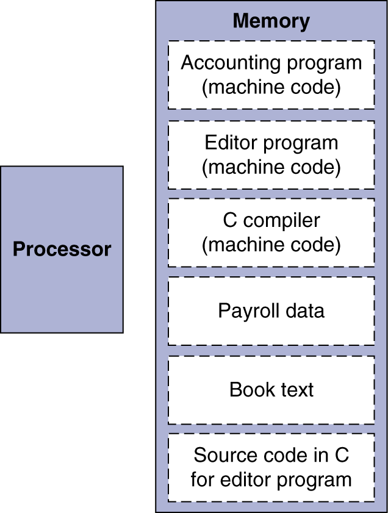

### Logical Operations

## §2\.6 Logical Operations

Instructions for bitwise manipulation

| Operation | C | Java | RISC\-V |
| :-: | :-: | :-: | :-: |
| Shift left | << | << | slli |
| Shift right | >> | >>> | srli |
| Bit\-by\-bit AND | & | & | and\, andi |
| Bit\-by\-bit OR | | | | | or\, ori |
| Bit\-by\-bit XOR | ^ | ^ | xor\, xori |
| Bit\-by\-bit NOT | ~ | ~ |  |

Useful for extracting and inserting groups of bits in a word

### Shift Operations

- immed: how many positions to shift
- Shift left logical
  - Shift left and fill with 0 bits
  - slli by  _i_  bits multiplies by 2 _i_
- Shift right logical
  - Shift right and fill with 0 bits
  - srli by  _i_  bits divides by 2 _i_  \(unsigned only\)

### AND Operations

- Useful to mask bits in a word
  - Select some bits\, clear others to 0
- and x9\,x10\,x11

00000000 00000000 00000000 00000000 00000000 00000000 00001101 11000000

00000000 00000000 00000000 00000000 00000000 00000000 00111100 00000000

00000000 00000000 00000000 00000000 00000000 00000000 00001100 00000000

### OR Operations

- Useful to include bits in a word
  - Set some bits to 1\, leave others unchanged
- or x9\,x10\,x11

00000000 00000000 00000000 00000000 00000000 00000000 00001101 11000000

00000000 00000000 00000000 00000000 00000000 00000000 00111100 00000000

00000000 00000000 00000000 00000000 00000000 00000000 00111101 11000000

- Differencing operation
  - Set some bits to 1\, leave others unchanged
- xor x9\,x10\,x12  // NOT operation

00000000 00000000 00000000 00000000 00000000 00000000 00001101  11000000

11111111    11111111  11111111   11111111   11111111   11111111   11111111   11111111

11111111    11111111  11111111   11111111   11111111   11111111   11110010  00111111

### Conditional Operations

- Branch to a labeled instruction if a condition is true
  - Otherwise\, continue sequentially
- beq rs1\, rs2\, L1
  - if \(rs1 == rs2\) branch to instruction labeled L1
- bne rs1\, rs2\, L1
  - if \(rs1 \!= rs2\) branch to instruction labeled L1

## §2\.7 Instructions for Making Decisions

### Compiling If Statements

- C code:

```c
if (i == j) 
  f = g + h;
else 
  f = g - h;
```

- f\, g\, … in x19\, x20\, …
- Compiled RISC\-V code:

```assembly
bne x22\, x23\, Else
add x19\, x20\, x21
beq x0\, x0\, Exit // unconditional
Else: sub x19\, x20\, x21
Exit: …
```

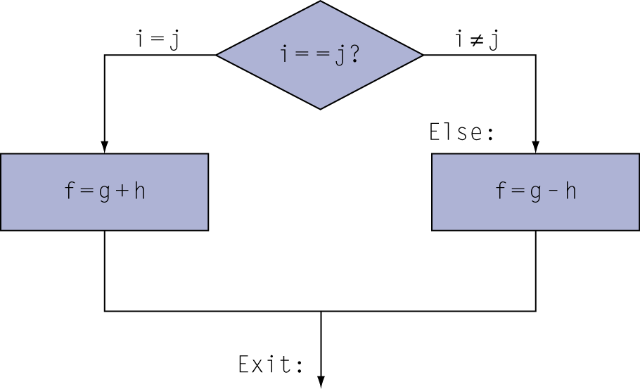

Assembler calculates addresses

### Compiling Loop Statements

- C code:

```c
while (save[i] == k) 
  i += 1;
```

- i in x22\, k in x24\, address of save in x25
- Compiled RISC\-V code:

```assembly
Loop: slli x10\, x22\, 3
      add  x10\, x10\, x25
      ld   x9\, 0\(x10\)
      bne  x9\, x24\, Exit
      addi x22\, x22\, 1
      beq  x0\, x0\, Loop
Exit: …
```

### Basic Blocks

- A basic block is a sequence of instructions with
  - No embedded branches \(except at end\)
  - No branch targets \(except at beginning\)

A compiler identifies basic blocks for optimization

An advanced processor can accelerate execution of basic blocks

### More Conditional Operations

```markdown
* blt rs1, rs2, L1
  * if (rs1 < rs2) branch to instruction labeled L1
* bge rs1, rs2, L1
  * if (rs1 >= rs2) branch to instruction labeled L1
* Example
  * if (a > b) a += 1;
  * a in x22, b in x23
  * bge x23, x22, Exit       // branch if b >= a
  * addi x22, x22, 1
  * Exit:
```

### Signed vs. Unsigned

- Signed comparison: blt\, bge
- Unsigned comparison: bltu\, bgeu
- Example
  - x22 = 1111 1111 1111 1111 1111 1111 1111 1111
  - x23 = 0000 0000 0000 0000 0000 0000 0000 0001
  - x22 < x23 // signed
    - –1 < \+1
  - x22 > x23 // unsigned
    - \+4\,294\,967\,295 > \+1

### Procedure Calling

- Steps required
  - Place parameters in registers x10 to x17
  - Transfer control to procedure
  - Acquire storage for procedure
  - Perform procedure’s operations
  - Place result in register for caller
  - Return to place of call \(address in x1\)

## §2\.8 Supporting Procedures in Computer Hardware

### Procedure Call Instructions

- Procedure call: jump and link
- jal x1\, ProcedureLabel
  - Address of following instruction put in x1
  - Jumps to target address
- Procedure return: jump and link register
- jalr x0\, 0\(x1\)
  - Like jal\, but jumps to 0 \+ address in x1
  - Use x0 as rd \(x0 cannot be changed\)
  - Can also be used for computed jumps
    - e\.g\.\, for case/switch statements

### Leaf Procedure Example

- C code:

```c
long long int leaf_example (long long int g, long long int h, long long int i, long long int j) {
  long long int f;
  f = (g + h) - (i + j);
  return f;
}
```

- Arguments g\, …\, j in x10\, …\, x13
- f in x20
- temporaries x5\, x6
- Need to save x5\, x6\, x20 on stack

RISC\-V code:

```assembly
leaf_example:
  addi sp\, sp\, -24
  sd   x5\, 16\(sp\)
  sd   x6\, 8\(sp\)
  sd   x20\, 0\(sp\)
  add  x5\, x10\, x11
  add  x6\, x12\, x13
  sub  x20\, x5\, x6
  addi x10\, x20\, 0
  ld   x20\, 0\(sp\)
  ld   x6\, 8\(sp\)
  ld   x5\, 16\(sp\)
  addi sp\, sp\, 24
  jalr x0\, 0\(x1\)
```

Save x5\, x6\, x20 on stack

copy f to return register

Restore x5\, x6\, x20 from stack

Return to caller

### Local Data on the Stack

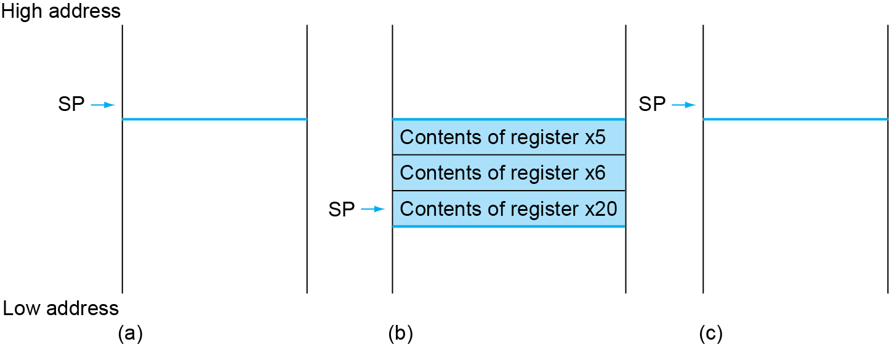

### Register Usage

- x5 – x7\, x28 – x31:  temporary registers
  - Not preserved by the callee
- x8 – x9\, x18 – x27:  saved registers
  - If used\, the callee saves and restores them

### Non-Leaf Procedures

- Procedures that call other procedures
- For nested call\, caller needs to save on the stack:
  - Its return address
  - Any arguments and temporaries needed after the call
- Restore from the stack after the call

### Non-Leaf Procedure Example

- C code:

```c
long long int fact (long long int n) {
  if (n < 1) return 1;
  else return n * fact(n - 1);
}
```

- Argument n in x10
- Result in x10

RISC\-V code:

```assembly
fact:
  addi sp\, sp\, -16
  sd   x1\, 8\(sp\)
  sd   x10\, 0\(sp\)
  addi x5\, x10\, -1
  bge  x5\, x0\, L1
  addi x10\, x0\, 1
  addi sp\, sp\, 16
  jalr x0\, 0\(x1\)
L1: addi x10\, x10\, -1
  jal  x1\, fact
  addi x6\, x10\, 0
  ld   x10\, 0\(sp\)
  ld   x1\, 8\(sp\)
  addi sp\, sp\, 16
  mul  x10\, x10\, x6
  jalr x0\, 0\(x1\)
```

Save return address and n on stack

if n >= 1\, go to L1

Else\, set return value to 1

Pop stack\, don’t bother restoring values

move result of fact\(n \- 1\) to x6

Restore caller’s n

Restore caller’s return address

return n \* fact\(n\-1\)

### Memory Layout

- Text: program code
- Static data: global variables
  - e\.g\.\, static variables in C\, constant arrays and strings
  - x3 \(global pointer\) initialized to address allowing ±offsets into this segment
- Dynamic data: heap
  - E\.g\.\, malloc in C\, new in Java
- Stack: automatic storage

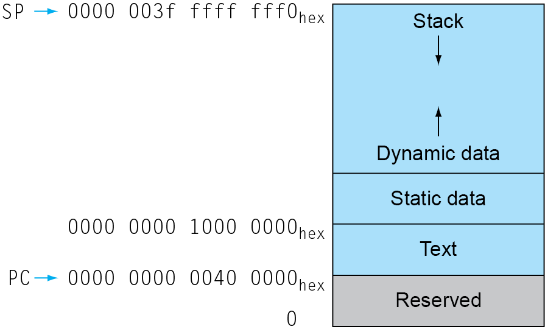

### Local Data on the Stack

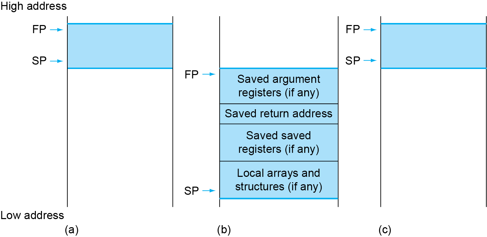

- Local data allocated by callee
  - e\.g\.\, C automatic variables
- Procedure frame \(activation record\)
  - Used by some compilers to manage stack storage

### Character Data

- Byte\-encoded character sets
  - ASCII: 128 characters
    - 95 graphic\, 33 control
  - Latin\-1: 256 characters
    - ASCII\, \+96 more graphic characters
- Unicode: 32\-bit character set
  - Used in Java\, C\+\+ wide characters\, …
  - Most of the world’s alphabets\, plus symbols
  - UTF\-8\, UTF\-16: variable\-length encodings

## §2\.9 Communicating with People

### Byte/Halfword/Word Operations

- RISC\-V byte/halfword/word load/store
  - Load byte/halfword/word: Sign extend to 64 bits in rd
    - lb rd\, offset\(rs1\)
    - lh rd\, offset\(rs1\)
    - lw rd\, offset\(rs1\)
  - Load byte/halfword/word unsigned: Zero extend to 64 bits in rd
    - lbu rd\, offset\(rs1\)
    - lhu rd\, offset\(rs1\)
    - lwu rd\, offset\(rs1\)
  - Store byte/halfword/word: Store rightmost 8/16/32 bits
    - sb rs2\, offset\(rs1\)
    - sh rs2\, offset\(rs1\)
    - sw rs2\, offset\(rs1\)

### String Copy Example

- C code:
  - Null\-terminated string
- void strcpy \(char x\[\]\, char y\[\]\)\{ size\_t i;  i = 0;  while \(\(x\[i\]=y\[i\]\)\!='\\0'\)    i \+= 1;\}

RISC\-V code:

```assembly
strcpy: addi sp\,sp\,\-8  // adjust stack for 1 doubleword
 sd   x19\,0\(sp\)      // push x19
 add  x19\,x0\,x0 // i=0
L1: add  x5\,x19\,x10 // x5 = addr of y\[i\]
 lbu  x6\,0\(x5\)  // x6 = y\[i\]
 add  x7\,x19\,x10 // x7 = addr of x\[i\]
 sb   x6\,0\(x7\)  // x\[i\] = y\[i\]
 beq  x6\,x0\,L2  // if y\[i\] == 0 then exit
 addi x19\,x19\, 1 // i = i \+ 1
 jal  x0\,L1  // next iteration of loop
L2: ld   x19\,0\(sp\) // restore saved x19
 addi sp\,sp\,8  // pop 1 doubleword from stack
 jalr x0\,0\(x1\)  // and return
```

### 32-bit Constants

- Most constants are small
  - 12\-bit immediate is sufficient
- For the occasional 32\-bit constant
- lui rd\, constant
  - Copies 20\-bit constant to bits \[31:12\] of rd
  - Extends bit 31 to bits \[63:32\]
  - Clears bits \[11:0\] of rd to 0

## §2\.10 RISC\-V Addressing for Wide Immediates and Addresses

lui x19\, 976  // 0x003D0

0000 0000 0000 0000

0000 0000 0000 0000

0000 0000 0011 1101 0000

addi x19\,x19\,1280  // 0x500

0000 0000 0000 0000

0000 0000 0000 0000

0000 0000 0011 1101 0000

### Branch Addressing

- Branch instructions specify
  - Opcode\, two registers\, target address
- Most branch targets are near branch
  - Forward or backward
- SB format:
- PC\-relative addressing
  - Target address = PC \+ immediate × 2

### Jump Addressing

Jump and link \(jal\) target uses 20\-bit immediate for larger range

UJ format:

- For long jumps\, eg\, to 32\-bit absolute address
  - lui: load address\[31:12\] to temp register
  - jalr: add address\[11:0\] and jump to target

### RISC-V Addressing Summary

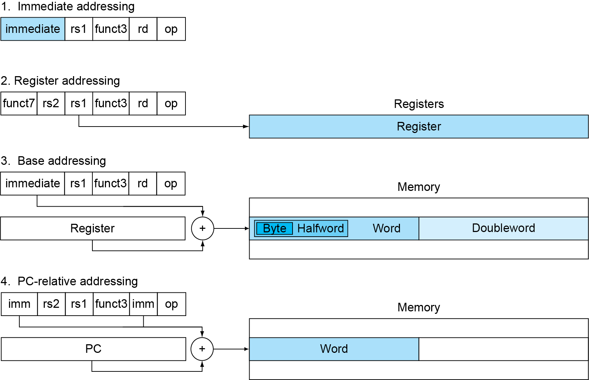

### RISC-V Encoding Summary

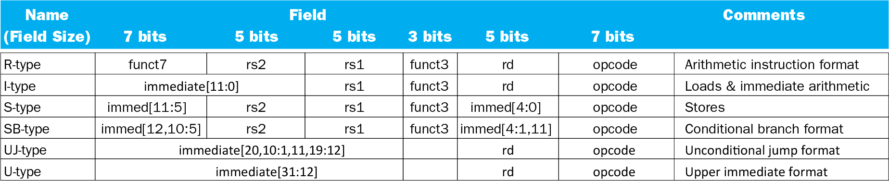

### Synchronization

- Two processors sharing an area of memory
  - P1 writes\, then P2 reads
  - Data race if P1 and P2 don’t synchronize
    - Result depends of order of accesses
- Hardware support required
  - Atomic read/write memory operation
  - No other access to the location allowed between the read and write
- Could be a single instruction
  - E\.g\.\, atomic swap of register ↔ memory
  - Or an atomic pair of instructions

## §2\.11 Parallelism and Instructions: Synchronization

### Synchronization in RISC-V

- Load reserved: lr\.d rd\,\(rs1\)
  - Load from address in rs1 to rd
  - Place reservation on memory address
- Store conditional: sc\.d rd\,\(rs1\)\,rs2
  - Store from rs2 to address in rs1
  - Succeeds if location not changed since the lr\.d
    - Returns 0 in rd
  - Fails if location is changed
    - Returns non\-zero value in rd

- Example 1: atomic swap \(to test/set lock variable\)
  - again: lr\.d x10\,\(x20\)
  - sc\.d x11\,\(x20\)\,x23 // X11 = status
  - bne  x11\,x0\,again  // branch if store failed
  - addi x23\,x10\,0     // X23 = loaded value
- Example 2:  lock
  - addi x12\,x0\,1   // copy locked value
  - again: lr\.d x10\,\(x20\)   // read lock
  - bne  x10\,x0\,again  // check if it is 0 yet
  - sc\.d x11\,\(x20\)\,x12  // attempt to store
  - bne  x11\,x0\,again // branch if fails
  - Unlock:
  - sd   x0\,0\(x20\)  // free lock

### Translation and Startup

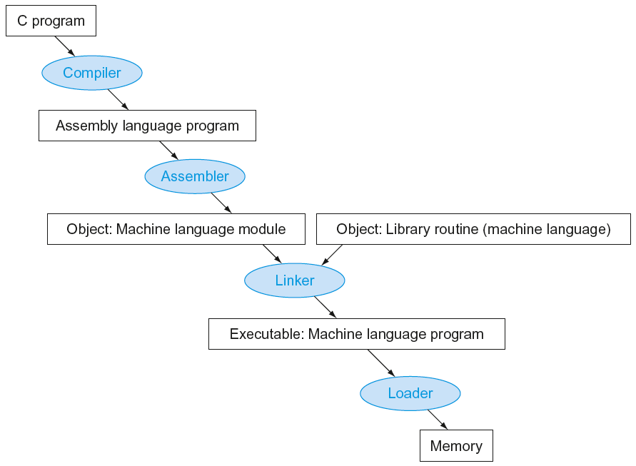

Many compilers produce object modules directly

## §2\.12 Translating and Starting a Program

### Producing an Object Module

- Assembler \(or compiler\) translates program into machine instructions
- Provides information for building a complete program from the pieces
  - Header: described contents of object module
  - Text segment: translated instructions
  - Static data segment: data allocated for the life of the program
  - Relocation info: for contents that depend on absolute location of loaded program
  - Symbol table: global definitions and external refs
  - Debug info: for associating with source code

### Linking Object Modules

- Produces an executable image
  - 1\. Merges segments
  - 2\. Resolve labels \(determine their addresses\)
  - 3\. Patch location\-dependent and external refs
- Could leave location dependencies for fixing by a relocating loader
  - But with virtual memory\, no need to do this
  - Program can be loaded into absolute location in virtual memory space

### Loading a Program

- Load from image file on disk into memory
  - 1\. Read header to determine segment sizes
  - 2\. Create virtual address space
  - 3\. Copy text and initialized data into memory
    - Or set page table entries so they can be faulted in
  - 4\. Set up arguments on stack
  - 5\. Initialize registers \(including sp\, fp\, gp\)
  - 6\. Jump to startup routine
    - Copies arguments to x10\, … and calls main
    - When main returns\, do exit syscall

### Dynamic Linking

- Only link/load library procedure when it is called
  - Requires procedure code to be relocatable
  - Avoids image bloat caused by static linking of all \(transitively\) referenced libraries
  - Automatically picks up new library versions

### Lazy Linkage

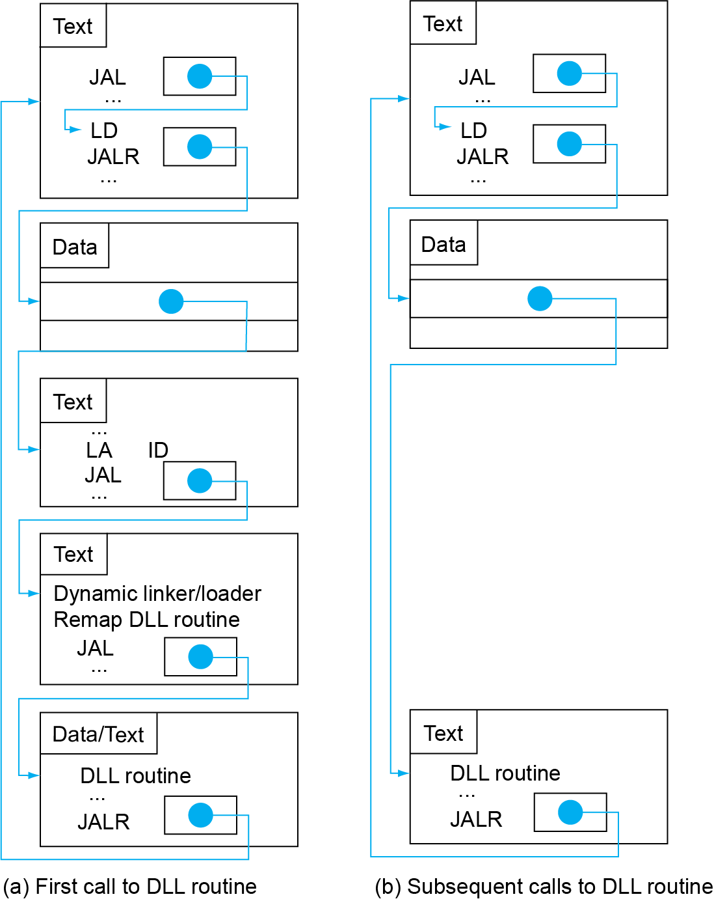

Indirection table

Stub: Loads routine ID\,Jump to linker/loader

Linker/loader code

Dynamicallymapped code

### Starting Java Applications

Simple portable instruction set for the JVM

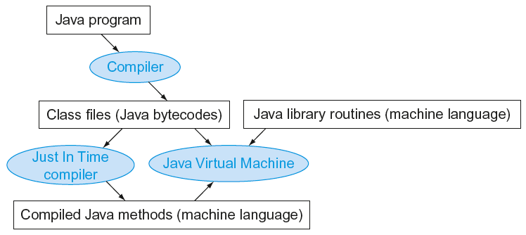

Compiles bytecodes of “hot” methods into native code for host machine

Interprets bytecodes

### C Sort Example

- Illustrates use of assembly instructions for a C bubble sort function
- Swap procedure \(leaf\)
  - void swap\(long long int v\[\]\,       long long int k\)\{  long long int temp;  temp = v\[k\];  v\[k\] = v\[k\+1\];  v\[k\+1\] = temp;\}
  - v in x10\, k in x11\, temp in x5

## §2\.13 A C Sort Example to Put It All Together

### The Procedure Swap

swap:

slli x6\,x11\,3    // reg x6 = k \* 8

add  x6\,x10\,x6   // reg x6 = v \+ \(k \* 8\)

ld   x5\,0\(x6\)    // reg x5 \(temp\) = v\[k\]

ld   x7\,8\(x6\)    // reg x7 = v\[k \+ 1\]

sd   x7\,0\(x6\)    // v\[k\] = reg x7

sd   x5\,8\(x6\)    // v\[k\+1\] = reg x5 \(temp\)

jalr x0\,0\(x1\)    // return to calling routine

### The Sort Procedure in C

- Non\-leaf \(calls swap\)
  - void sort \(long long int v\[\]\, size\_t n\)
  - \{
  - size\_t i\, j;
  - for \(i = 0; i < n; i \+= 1\) \{
  - for \(j = i – 1;
  - j >= 0 && v\[j\] > v\[j \+ 1\];
  - j \-= 1\) \{
  - swap\(v\,j\);
  - \}
  - \}
  - \}
  - v in x10\, n in x11\, i in x19\, j in x20

### The Outer Loop

- Skeleton of outer loop:
  - for \(i = 0; i <n; i \+= 1\) \{
- li   x19\,0       // i = 0
- for1tst:
- bge  x19\,x11\,exit1   // go to exit1 if x19 ≥ x11 \(i≥n\)
- \(body of outer for\-loop\)
- addi x19\,x19\,1      // i \+= 1
- j    for1tst      // branch to test of outer loop
- exit1:

### The Inner Loop

- Skeleton of inner loop:
  - for \(j = i − 1; j >= 0 && v\[j\] > v\[j \+ 1\]; j − = 1\) \{
- addi x20\,x19\,\-1    // j = i −1
- for2tst:
- blt  x20\,x0\,exit2  // go to exit2 if X20 < 0 \(j < 0\)
- slli x5\,x20\,3      // reg x5 = j \* 8
- add  x5\,x10\,x5     // reg x5 = v \+ \(j \* 8\)
- ld   x6\,0\(x5\)      // reg x6 = v\[j\]
- ld   x7\,8\(x5\)      // reg x7 = v\[j \+ 1\]
- ble  x6\,x7\,exit2   // go to exit2 if x6 ≤ x7
- mv   x21\, x10      // copy parameter x10 into x21
- mv   x22\, x11      // copy parameter x11 into x22
- mv   x10\, x21      // first swap parameter is v
- mv   x11\, x20      // second swap parameter is j
- jal  x1\,swap   // call swap
- addi x20\,x20\,\-1   // j –= 1
- j    for2tst   // branch to test of inner loop
- exit2:

### Preserving Registers

Preserve saved registers:

addi sp\,sp\,\-40  // make room on stack for 5 regs

sd   x1\,32\(sp\)  // save x1 on stack

sd   x22\,24\(sp\) // save x22 on stack

sd   x21\,16\(sp\) // save x21 on stack

sd   x20\,8\(sp\)  // save x20 on stack

sd   x19\,0\(sp\)  // save x19 on stack

Restore saved registers:

exit1:

sd   x19\,0\(sp\)   // restore x19 from stack

sd   x20\,8\(sp\)  // restore x20 from stack

sd   x21\,16\(sp\) // restore x21 from stack

sd   x22\,24\(sp\) // restore x22 from stack

sd   x1\,32\(sp\)  // restore x1 from stack

addi sp\,sp\, 40  // restore stack pointer

jalr x0\,0\(x1\)

### Effect of Compiler Optimization

Compiled with gcc for Pentium 4 under Linux

### Effect of Language and Algorithm

### Lessons Learnt

- Instruction count and CPI are not good performance indicators in isolation
- Compiler optimizations are sensitive to the algorithm
- Java/JIT compiled code is significantly faster than JVM interpreted
  - Comparable to optimized C in some cases
- Nothing can fix a dumb algorithm\!

### Arrays vs. Pointers

- Array indexing involves
  - Multiplying index by element size
  - Adding to array base address
- Pointers correspond directly to memory addresses
  - Can avoid indexing complexity

## §2\.14 Arrays versus Pointers

### Example: Clearing an Array

| clear1\(int array\[\]\, int size\) \{  int i;  for \(i = 0; i < size; i \+= 1\)    array\[i\] = 0;\} | clear2\(int \*array\, int size\) \{  int \*p;  for \(p = &array\[0\]; p < &array\[size\];       p = p \+ 1\)    \*p = 0;\} |
| :-: | :-: |
| li   x5\,0       // i = 0
loop1:   slli x6\,x5\,3    // x6 = i \* 8
   add  x7\,x10\,x6  // x7 = address                   // of array\[i\]
   sd   x0\,0\(x7\)   // array\[i\] = 0
   addi x5\,x5\,1    // i = i \+ 1
   blt  x5\,x11\,loop1  // if \(i<size\)                      // go to loop1 | mv x5\,x10      // p = address                  // of array\[0\]
   slli x6\,x11\,3  // x6 = size \* 8
   add x7\,x10\,x6  // x7 = address                  // of array\[size\]
loop2:   sd x0\,0\(x5\)    // Memory\[p\] = 0
   addi x5\,x5\,8   // p = p \+ 8
   bltu x5\,x7\,loop2                  // if \(p<&array\[size\]\)                  // go to loop2 |

### Comparison of Array vs. Ptr

- Multiply “strength reduced” to shift
- Array version requires shift to be inside loop
  - Part of index calculation for incremented i
  - c\.f\. incrementing pointer
- Compiler can achieve same effect as manual use of pointers
  - Induction variable elimination
  - Better to make program clearer and safer

### MIPS Instructions

- MIPS: commercial predecessor to RISC\-V
- Similar basic set of instructions
  - 32\-bit instructions
  - 32 general purpose registers\, register 0 is always 0
  - 32 floating\-point registers
  - Memory accessed only by load/store instructions
    - Consistent use of addressing modes for all data sizes
- Different conditional branches
  - For \<\, <=\, >\, >=
  - RISC\-V: blt\, bge\, bltu\, bgeu
  - MIPS: slt\, sltu \(set less than\, result is 0 or 1\)
    - Then use beq\, bne to complete the branch

## §2\.16 Real Stuff: MIPS Instructions

### Instruction Encoding

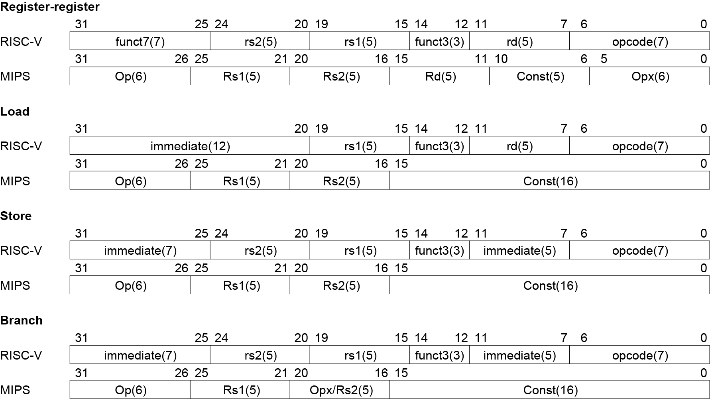

### The Intel x86 ISA

- Evolution with backward compatibility
  - 8080 \(1974\): 8\-bit microprocessor
    - Accumulator\, plus 3 index\-register pairs
  - 8086 \(1978\): 16\-bit extension to 8080
    - Complex instruction set \(CISC\)
  - 8087 \(1980\): floating\-point coprocessor
    - Adds FP instructions and register stack
  - 80286 \(1982\): 24\-bit addresses\, MMU
    - Segmented memory mapping and protection
  - 80386 \(1985\): 32\-bit extension \(now IA\-32\)
    - Additional addressing modes and operations
    - Paged memory mapping as well as segments

## §2\.19 Real Stuff: x86 Instructions

- Further evolution…
  - i486 \(1989\): pipelined\, on\-chip caches and FPU
    - Compatible competitors: AMD\, Cyrix\, …
  - Pentium \(1993\): superscalar\, 64\-bit datapath
    - Later versions added MMX \(Multi\-Media eXtension\) instructions
    - The infamous FDIV bug
  - Pentium Pro \(1995\)\, Pentium II \(1997\)
    - New microarchitecture \(see Colwell\,  _The Pentium Chronicles_ \)
  - Pentium III \(1999\)
    - Added SSE \(Streaming SIMD Extensions\) and associated registers
  - Pentium 4 \(2001\)
    - New microarchitecture
    - Added SSE2 instructions

- And further…
  - AMD64 \(2003\): extended architecture to 64 bits
  - EM64T – Extended Memory 64 Technology \(2004\)
    - AMD64 adopted by Intel \(with refinements\)
    - Added SSE3 instructions
  - Intel Core \(2006\)
    - Added SSE4 instructions\, virtual machine support
  - AMD64 \(announced 2007\): SSE5 instructions
    - Intel declined to follow\, instead…
  - Advanced Vector Extension \(announced 2008\)
    - Longer SSE registers\, more instructions
- If Intel didn’t extend with compatibility\, its competitors would\!
  - Technical elegance ≠ market success

### Basic x86 Registers

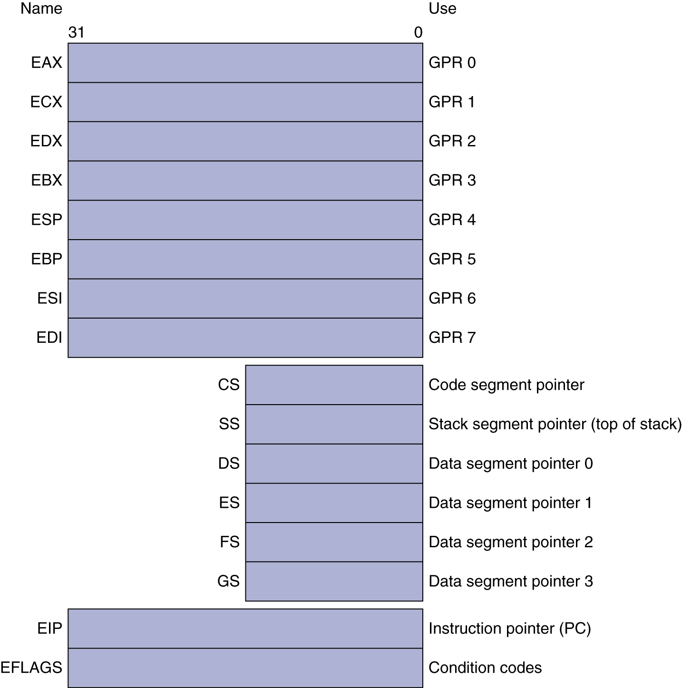

### Basic x86 Addressing Modes

Two operands per instruction

| Source/dest operand | Second source operand |
| :-: | :-: |
| Register | Register |
| Register | Immediate |
| Register | Memory |
| Memory | Register |
| Memory | Immediate |

- Memory addressing modes
  - Address in register
  - Address = Rbase \+ displacement
  - Address = Rbase \+ 2scale × Rindex \(scale = 0\, 1\, 2\, or 3\)
  - Address =  Rbase \+ 2scale × Rindex \+ displacement

### x86 Instruction Encoding

- Variable length encoding
  - Postfix bytes specify addressing mode
  - Prefix bytes modify operation
    - Operand length\, repetition\, locking\, …


### Implementing IA-32

- Complex instruction set makes implementation difficult
  - Hardware translates instructions to simpler microoperations
    - Simple instructions: 1–1
    - Complex instructions: 1–many
  - Microengine similar to RISC
  - Market share makes this economically viable
- Comparable performance to RISC
  - Compilers avoid complex instructions

### Other RISC-V Instructions

- Base integer instructions \(RV64I\)
  - Those previously described\, plus
  - auipc rd\, immed  // rd = \(imm<<12\) \+ pc
    - follow by jalr \(adds 12\-bit immed\) for long jump
  - slt\, sltu\, slti\, sltui: set less than \(like MIPS\)
  - addw\, subw\, addiw: 32\-bit add/sub
  - sllw\, srlw\, srlw\, slliw\, srliw\, sraiw: 32\-bit shift
- 32\-bit variant: RV32I
  - registers are 32\-bits wide\, 32\-bit operations

## §2\.20 The Rest of the RISC\-V Instruction Set

### Instruction Set Extensions

- M: integer multiply\, divide\, remainder
- A: atomic memory operations
- F: single\-precision floating point
- D: double\-precision floating point
- C: compressed instructions
  - 16\-bit encoding for frequently used instructions

### Fallacies

- Powerful instruction  higher performance
  - Fewer instructions required
  - But complex instructions are hard to implement
    - May slow down all instructions\, including simple ones
  - Compilers are good at making fast code from simple instructions
- Use assembly code for high performance
  - But modern compilers are better at dealing with modern processors
  - More lines of code  more errors and less productivity

## §2\.22 Fallacies and Pitfalls

- Backward compatibility  instruction set doesn’t change
  - But they do accrete more instructions

x86 instruction set

### Pitfalls

- Sequential words are not at sequential addresses
  - Increment by 4\, not by 1\!
- Keeping a pointer to an automatic variable after procedure returns
  - e\.g\.\, passing pointer back via an argument
  - Pointer becomes invalid when stack popped


### Concluding Remarks


* Design principles
  * 1\.	Simplicity favors regularity
  * 2\.	Smaller is faster
  * 3\.	Good design demands good compromises
* Make the common case fast
* Layers of software/hardware
  * Compiler\, assembler\, hardware
* RISC\-V: typical of RISC ISAs
  * c\.f\. x86


## §2\.23 Concluding Remarks


