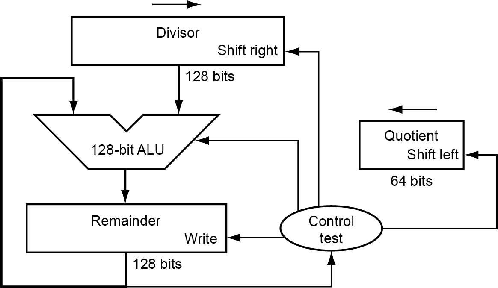

# Chapter 3

- [Chapter 1](CA_ch1.md)
- [Chapter 2](CA_ch2.md)
- [Chapter 3](CA_ch3.md)
- [Chapter 4](CA_ch4.md)
- [Chapter 5](CA_ch5.md)
- [Chapter 6](CA_ch6.md)

# Arithmetic for Computers

## §3.1 Introduction

* Operations on integers
  * Addition and subtraction
  * Multiplication and division
  * Dealing with overflow
* Floating-point real numbers
  * Representation and operations

### Integer Addition

Example: 7 + 6

## §3.2 Addition and Subtraction

* Overflow if result out of range
  * Adding +ve and –ve operands, no overflow
  * Adding two +ve operands
    * Overflow if result sign is 1
  * Adding two –ve operands
    * Overflow if result sign is 0

### Integer Subtraction

* Add negation of second operand
* Example: 7 – 6 = 7 + (–6)
  * +7: 0000 0000 … 0000 0111 _–6: 1111 1111 … 1111 1010_ +1: 0000 0000 … 0000 0001
* Overflow if result out of range
  * Subtracting two +ve or two –ve operands, no overflow
  * Subtracting +ve from –ve operand
    * Overflow if result sign is 0
  * Subtracting –ve from +ve operand
    * Overflow if result sign is 1

### Arithmetic for Multimedia

* Graphics and media processing operates on vectors of 8-bit and 16-bit data
  * Use 64-bit adder, with partitioned carry chain
    * Operate on 8×8-bit, 4×16-bit, or 2×32-bit vectors
  * SIMD (single-instruction, multiple-data)
* Saturating operations
  * On overflow, result is largest representable value
    * c.f. 2s-complement modulo arithmetic
  * E.g., clipping in audio, saturation in video

1000

×  1001

1000

0000

0000

1000

1001000

### Multiplication

## §3.3 Multiplication

Start with long-multiplication approach

Length of product is the sum of operand lengths

### Multiplication Hardware

### Optimized Multiplier

Perform steps in parallel: add/shift

* One cycle per partial-product addition
  * That’s ok, if frequency of multiplications is low

### Faster Multiplier

* Uses multiple adders
  * Cost/performance tradeoff

* Can be pipelined
  * Several multiplication performed in parallel

### RISC-V Multiplication

* Four multiply instructions:
  * mul:  multiply
    * Gives the lower 64 bits of the product
  * mulh:  multiply high
    * Gives the upper 64 bits of the product, assuming the operands are signed
  * mulhu:  multiply high unsigned
    * Gives the upper 64 bits of the product, assuming the operands are unsigned
  * mulhsu:  multiply high signed/unsigned
    * Gives the upper 64 bits of the product, assuming one operand is signed and the other unsigned
  * Use mulh result to check for 64-bit overflow

### Division

* Check for 0 divisor
* Long division approach
  * If divisor ≤ dividend bits
    * 1 bit in quotient, subtract
  * Otherwise
    * 0 bit in quotient, bring down next dividend bit
* Restoring division
  * Do the subtract, and if remainder goes < 0, add divisor back
* Signed division
  * Divide using absolute values
  * Adjust sign of quotient and remainder as required

1001

1000 1001010

-1000

10

101

1010

-1000

10

n-bit operands yield n-bit quotient and remainder

### Division Hardware

Initially divisor in left half

Initially dividend

### Optimized Divider

* One cycle per partial-remainder subtraction
* Looks a lot like a multiplier!
  * Same hardware can be used for both

### Faster Division

* Can’t use parallel hardware as in multiplier
  * Subtraction is conditional on sign of remainder
* Faster dividers (e.g. SRT devision) generate multiple quotient bits per step
  * Still require multiple steps

### RISC-V Division

* Four instructions:
  * div, rem: signed divide, remainder
  * divu, remu: unsigned divide, remainder
* Overflow and division-by-zero don’t produce errors
  * Just return defined results
  * Faster for the common case of no error

### Floating Point

## §3.5 Floating Point

* Representation for non-integral numbers
  * Including very small and very large numbers
* Like scientific notation
  * –2.34 × 1056
  * +0.002 × 10–4
  * +987.02 × 109
* In binary
  * ±1. _xxxxxxx_ 2 × 2 _yyyy_
* Types float and double in C

### Floating Point Standard

* Defined by IEEE Std 754-1985
* Developed in response to divergence of representations
  * Portability issues for scientific code
* Now almost universally adopted
* Two representations
  * Single precision (32-bit)
  * Double precision (64-bit)

### IEEE Floating-Point Format

single: 8 bits double: 11 bits

single: 23 bits double: 52 bits

* S: sign bit (0  non-negative, 1  negative)
* Normalize significand: 1.0 ≤ |significand| < 2.0
  * Always has a leading pre-binary-point 1 bit, so no need to represent it explicitly (hidden bit)
  * Significand is Fraction with the “1.” restored
* Exponent: excess representation: actual exponent + Bias
  * Ensures exponent is unsigned
  * Single: Bias = 127; Double: Bias = 1203

### Single-Precision Range

* Exponents 00000000 and 11111111 reserved
* Smallest value
  * Exponent: 00000001 actual exponent = 1 – 127 = –126
  * Fraction: 000…00  significand = 1.0
  * ±1.0 × 2–126 ≈ ±1.2 × 10–38
* Largest value
  * exponent: 11111110 actual exponent = 254 – 127 = +127
  * Fraction: 111…11  significand ≈ 2.0
  * ±2.0 × 2+127 ≈ ±3.4 × 10+38

### Double-Precision Range

* Exponents 0000…00 and 1111…11 reserved
* Smallest value
  * Exponent: 00000000001 actual exponent = 1 – 1023 = –1022
  * Fraction: 000…00  significand = 1.0
  * ±1.0 × 2–1022 ≈ ±2.2 × 10–308
* Largest value
  * Exponent: 11111111110 actual exponent = 2046 – 1023 = +1023
  * Fraction: 111…11  significand ≈ 2.0
  * ±2.0 × 2+1023 ≈ ±1.8 × 10+308

### Floating-Point Precision

* Relative precision
  * all fraction bits are significant
  * Single: approx 2–23
    * Equivalent to 23 × log102 ≈ 23 × 0.3 ≈ 6 decimal digits of precision
  * Double: approx 2–52
    * Equivalent to 52 × log102 ≈ 52 × 0.3 ≈ 16 decimal digits of precision

### Floating-Point Example

* Represent –0.75
  * –0.75 = (–1)1 × 1.12 × 2–1
  * S = 1
  * Fraction = 1000…002
  * Exponent = –1 + Bias
    * Single: –1 + 127 = 126 =  01111110 2
    * Double: –1 + 1023 = 1022 =  01111111110 2
* Single: 1 01111110 1000…00
* Double: 1 01111111110 1000…00

* What number is represented by the single-precision float
* 1 10000001 01000…00
  * S = 1
  * Fraction = 01000…002
  * Fxponent =  10000001 2 = 129
* x = (–1)1 × (1 + 012) × 2(129 – 127)
  * = (–1) × 1.25 × 22
  * = –5.0

### Denormal Numbers

Exponent = 000...0  hidden bit is 0

* Smaller than normal numbers
  * allow for gradual underflow, with diminishing precision
* Denormal with fraction = 000...0

Two representations of 0.0!

### Infinities and NaNs

* Exponent = 111...1, Fraction = 000...0
  * ±Infinity
  * Can be used in subsequent calculations, avoiding need for overflow check
* Exponent = 111...1, Fraction ≠ 000...0
  * Not-a-Number (NaN)
  * Indicates illegal or undefined result
    * e.g., 0.0 / 0.0
  * Can be used in subsequent calculations

### Floating-Point Addition

* Consider a 4-digit decimal example
  * 9.999 × 101 + 1.610 × 10–1
* 1. Align decimal points
  * Shift number with smaller exponent
  * 9.999 × 101 + 0.016 × 101
* 2. Add significands
  * 9.999 × 101 + 0.016 × 101 = 10.015 × 101
* 3. Normalize result & check for over/underflow
  * 1.0015 × 102
* 4. Round and renormalize if necessary
  * 1.002 × 102

* Now consider a 4-digit binary example
  * 1.0002 × 2–1 + –1.1102 × 2–2 (0.5 + –0.4375)
* 1. Align binary points
  * Shift number with smaller exponent
  * 1.0002 × 2–1 + –0.1112 × 2–1
* 2. Add significands
  * 1.0002 × 2–1 + –0.1112 × 2–1 = 0.0012 × 2–1
* 3. Normalize result & check for over/underflow
  * 1.0002 × 2–4, with no over/underflow
* 4. Round and renormalize if necessary
  * 1.0002 × 2–4 (no change)  = 0.0625

### FP Adder Hardware

* Much more complex than integer adder
* Doing it in one clock cycle would take too long
  * Much longer than integer operations
  * Slower clock would penalize all instructions
* FP adder usually takes several cycles
  * Can be pipelined

### Floating-Point Multiplication

* Consider a 4-digit decimal example
  * 1.110 × 1010 × 9.200 × 10–5
* 1. Add exponents
  * For biased exponents, subtract bias from sum
  * New exponent = 10 + –5 = 5
* 2. Multiply significands
  * 1.110 × 9.200 = 10.212    10.212 × 105
* 3. Normalize result & check for over/underflow
  * 1.0212 × 106
* 4. Round and renormalize if necessary
  * 1.021 × 106
* 5. Determine sign of result from signs of operands
  * +1.021 × 106

* Now consider a 4-digit binary example
  * 1.0002 × 2–1 × –1.1102 × 2–2 (0.5 × –0.4375)
* 1. Add exponents
  * Unbiased: –1 + –2 = –3
  * Biased: (–1 + 127) + (–2 + 127) = –3 + 254 – 127 = –3 + 127
* 2. Multiply significands
  * 1.0002 × 1.1102 = 1.1102    1.1102 × 2–3
* 3. Normalize result & check for over/underflow
  * 1.1102 × 2–3 (no change) with no over/underflow
* 4. Round and renormalize if necessary
  * 1.1102 × 2–3 (no change)
* 5. Determine sign: +ve × –ve  –ve
  * –1.1102 × 2–3  = –0.21875

### FP Arithmetic Hardware

* FP multiplier is of similar complexity to FP adder
  * But uses a multiplier for significands instead of an adder
* FP arithmetic hardware usually does
  * Addition, subtraction, multiplication, division, reciprocal, square-root
  * FP  integer conversion
* Operations usually takes several cycles
  * Can be pipelined

### FP Instructions in RISC-V

* Separate FP registers: f0, …, f31
  * double-precision
  * single-precision values stored in the lower 32 bits
* FP instructions operate only on FP registers
  * Programs generally don’t do integer ops on FP data, or vice versa
  * More registers with minimal code-size impact
* FP load and store instructions
  * flw, fld
  * fsw, fsd

* Single-precision arithmetic
  * fadd.s, fsub.s, fmul.s, fdiv.s, fsqrt.s
    * e.g., fadds.s f2, f4, f6
* Double-precision arithmetic
  * fadd.d, fsub.d, fmul.d, fdiv.d, fsqrt.d
    * e.g., fadd.d f2, f4, f6
* Single- and double-precision comparison
  * feq.s, flt.s, fle.s
  * feq.d, flt.d, fle.d
  * Result is 0 or 1 in integer destination register
    * Use beq, bne to branch on comparison result
* Branch on FP condition code true or false
  * B.cond

### FP Example: °F to °C

* C code:
* float f2c (float fahr) {  return ((5.0/9.0)*(fahr - 32.0));}
  * fahr in f10, result in f10, literals in global memory space
* Compiled RISC-V code:
* f2c:
* flw    f0,const5(x3)  // f0 = 5.0f
* flw    f1,const9(x3)  // f1 = 9.0f
* fdiv.s f0, f0, f1  // f0 = 5.0f / 9.0f
* flw    f1,const32(x3) // f1 = 32.0f
* fsub.s f10,f10,f1  // f10 = fahr – 32.0
* fmul.s f10,f0,f10  // f10 = (5.0f/9.0f) * (fahr–32.0f)
* jalr   x0,0(x1)    // return

### FP Example: Array Multiplication

* C = C + A × B
  * All 32 × 32 matrices, 64-bit double-precision elements
* C code:
* void mm (double c[][],         double a[][], double b[][]) {  size_t i, j, k;  for (i = 0; i < 32; i = i + 1)    for (j = 0; j < 32; j = j + 1)      for (k = 0; k < 32; k = k + 1)        c[i][j] = c[i][j]                  + a[i][k] * b[k][j];}
  * Addresses of c, a, b in x10, x11, x12, andi, j, k in x5, x6, x7

RISC-V code:

mm: ...

li    x28,32       // x28 = 32 (row size/loop end)

li    x5,0         // i = 0; initialize 1st for loop

L1:    li    x6,0         // j = 0; initialize 2nd for loop

L2:    li    x7,0         // k = 0; initialize 3rd for loop

slli  x30,x5,5     // x30 = i * 2**5 (size of row of c)

add   x30,x30,x6   // x30 = i * size(row) + j

slli  x30,x30,3    // x30 = byte offset of [i][j]

add   x30,x10,x30  // x30 = byte address of c[i][j]

fld   f0,0(x30)    // f0 = c[i][j]

L3:    slli  x29,x7,5     // x29 = k * 2**5 (size of row of b)

add   x29,x29,x6   // x29 = k * size(row) + j

slli  x29,x29,3    // x29 = byte offset of [k][j]

add   x29,x12,x29  // x29 = byte address of b[k][j]

fld   f1,0(x29)    // f1 = b[k][j]

…

slli   x29,x5,5     // x29 = i * 2**5 (size of row of a)

add    x29,x29,x7   // x29 = i * size(row) + k

slli   x29,x29,3    // x29 = byte offset of [i][k]

add    x29,x11,x29  // x29 = byte address of a[i][k]

fld    f2,0(x29)    // f2 = a[i][k]

fmul.d f1, f2, f1   // f1 = a[i][k] * b[k][j]

fadd.d f0, f0, f1   // f0 = c[i][j] + a[i][k] * b[k][j]

addi   x7,x7,1      // k = k + 1

bltu   x7,x28,L3    // if (k < 32) go to L3

fsd    f0,0(x30)    // c[i][j] = f0

addi   x6,x6,1      // j = j + 1

bltu   x6,x28,L2    // if (j < 32) go to L2

addi   x5,x5,1      // i = i + 1

bltu   x5,x28,L1    // if (i < 32) go to L1

### Accurate Arithmetic

* IEEE Std 754 specifies additional rounding control
  * Extra bits of precision (guard, round, sticky)
  * Choice of rounding modes
  * Allows programmer to fine-tune numerical behavior of a computation
* Not all FP units implement all options
  * Most programming languages and FP libraries just use defaults
* Trade-off between hardware complexity, performance, and market requirements

### Subword Parallellism

* Graphics and audio applications can take advantage of performing simultaneous operations on short vectors
  * Example:  128-bit adder:
    * Sixteen 8-bit adds
    * Eight 16-bit adds
    * Four 32-bit adds
* Also called data-level parallelism, vector parallelism, or Single Instruction, Multiple Data (SIMD)

## §3.6 Parallelism and Computer Arithmetic: Subword Parallelism

### x86 FP Architecture

* Originally based on 8087 FP coprocessor
  * 8 × 80-bit extended-precision registers
  * Used as a push-down stack
  * Registers indexed from TOS: ST(0), ST(1), …
* FP values are 32-bit or 64 in memory
  * Converted on load/store of memory operand
  * Integer operands can also be convertedon load/store
* Very difficult to generate and optimize code
  * Result: poor FP performance

## §3.7 Real Stuff: Streaming SIMD Extensions and AVX in x86

### x86 FP Instructions

| Data transfer | Arithmetic | Compare | Transcendental |
| :-: | :-: | :-: | :-: |
| F _I_ LD  mem/ST(i)F _I_ ST _P_  mem/ST(i)FLDPIFLD1FLDZ | F _I_ ADD _P_   mem/ST(i)F _I_ SUB _RP_  mem/ST(i) F _I_ MUL _P_   mem/ST(i) F _I_ DIV _RP_  mem/ST(i)FSQRTFABSFRNDINT | F _I_ COM _P_ F _I_ UCOM _P_ FSTSW AX/mem | FPATANF2XMIFCOSFPTANFPREMFPSINFYL2X |

* Optional variations
  * _I_ : integer operand
  * _P_ : pop operand from stack
  * _R_ : reverse operand order
  * But not all combinations allowed

### Streaming SIMD Extension 2 (SSE2)

* Adds 4 × 128-bit registers
  * Extended to 8 registers in AMD64/EM64T
* Can be used for multiple FP operands
  * 2 × 64-bit double precision
  * 4 × 32-bit double precision
  * Instructions operate on them simultaneously
    * _S_ ingle- _I_ nstruction  _M_ ultiple- _D_ ata

### Matrix Multiply

Unoptimized code:

1. void dgemm (int n, double* A, double* B, double* C)

2. {

3.  for (int i = 0; i < n; ++i)

4.    for (int j = 0; j < n; ++j)

5.    {

6.     double cij = C[i+j*n]; /* cij = C[i][j] */

7.     for(int k = 0; k < n; k++ )

8.      cij += A[i+k*n] * B[k+j*n]; /* cij += A[i][k]*B[k][j] */

9.     C[i+j*n] = cij; /* C[i][j] = cij */

10.   }

11. }

## §3.8 Going Faster:  Subword Parallelism and Matrix Multiply

Optimized C code:

1. #include <x86intrin.h>

2. void dgemm (int n, double* A, double* B, double* C)

3. {

4. for (int i = 0; i < n; i+=8)

5.	for (int j = 0; j < n; ++j)

6.	 {

7.		__m512d c0 =  _mm512_load_pd(C+i+j*n); // c0 = C[i][j]

8.	      for( int k = 0; k < n; k++ )

9.	        {  // c0 += A[i][k]*B[k][j]

10.	         __m512d bb = _mm512_broadcastsd_pd(_mm_load_sd(B+j*n+k));

11.	         c0 = _mm512_fmadd_pd(_mm512_load_pd(A+n*k+i), bb, c0);

12.	        }

13.	    _mm512_store_pd(C+i+j*n, c0); // C[i][j] = c0

14.	 }

15.}

Optimized x86 assembly code:

| vmovapd (%r11),%zmm1 | ### Load 8 elements of C into %zmm1 |
| :-: | :-: |
| mov     %rbx,%rcx | ### register %rcx = %rbx |
| xor     %eax,%eax | ### register %eax = 0 |
| vbroadcastsd (%rax,%r8,8),%zmm0 | ### Make 8 copies of B element in %zmm0 |
| add     $0x8,%rax | ### register %rax = %rax + 8 |
| vfmadd231pd   (%rcx),%zmm0,%zmm1 | ### Parallel mul & add %zmm0, %zmm1 |
| add     %r9,%rcx | ### register %rcx = %rcx |
| cmp     %r10,%rax | ### compare %r10 to %rax |
| jne     50 <dgemm+0x50> | ### jump if not %r10 != %rax |
| add     $0x1, %esi | ### register % esi = % esi + 1 |
| vmovapd %zmm1, (%r11) | ### Store %zmm1 into 8 C elements |

### Right Shift and Division

* Left shift by  _i_  places multiplies an integer by 2 _i_
* Right shift divides by 2 _i_ ?
  * Only for unsigned integers
* For signed integers
  * Arithmetic right shift: replicate the sign bit
  * e.g., –5 / 4
    * 111110112 >> 2 = 111111102 = –2
    * Rounds toward –∞
  * c.f. 111110112 >>> 2 = 001111102 = +62

## §3.9 Fallacies and Pitfalls

### Associativity

* Parallel programs may interleave operations in unexpected orders
  * Assumptions of associativity may fail

Need to validate parallel programs under varying degrees of parallelism

### Who Cares About FP Accuracy?

* Important for scientific code
  * But for everyday consumer use?
    * “My bank balance is out by 0.0002¢!” 
* The Intel Pentium FDIV bug
  * The market expects accuracy
  * See Colwell,  _The Pentium Chronicles_

### Concluding Remarks

* Bits have no inherent meaning
  * Interpretation depends on the instructions applied
* Computer representations of numbers
  * Finite range and precision
  * Need to account for this in programs

## §3.10 Concluding Remarks

* ISAs support arithmetic
  * Signed and unsigned integers
  * Floating-point approximation to reals
* Bounded range and precision
  * Operations can overflow and underflow

