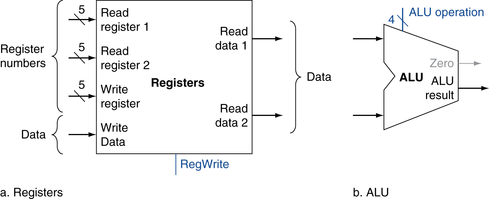
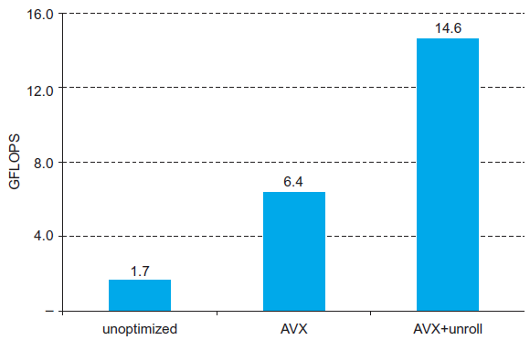

# Chapter 4

# The Processor

# Introduction

§4\.1 Introduction

* CPU performance factors
  * Instruction count
    * Determined by ISA and compiler
  * CPI and Cycle time
    * Determined by CPU hardware
* We will examine two RISC\-V implementations
  * A simplified version
  * A more realistic pipelined version
* Simple subset\, shows most aspects
  * Memory reference: ld\, sd
  * Arithmetic/logical: add\, sub\, and\, or
  * Control transfer: beq

Chapter 4 — The Processor —

# Instruction Execution

* PC  instruction memory\, fetch instruction
* Register numbers  register file\, read registers
* Depending on instruction class
  * Use ALU to calculate
    * Arithmetic result
    * Memory address for load/store
    * Branch comparison
  * Access data memory for load/store
  * PC  target address or PC \+ 4

Chapter 4 — The Processor —

# CPU Overview

Chapter 4 — The Processor —

# Multiplexers

* Can’t just join wires together
  * Use multiplexers

Chapter 4 — The Processor —

# Control

Chapter 4 — The Processor —

# Logic Design Basics

* Information encoded in binary
  * Low voltage = 0\, High voltage = 1
  * One wire per bit
  * Multi\-bit data encoded on multi\-wire buses
* Combinational element
  * Operate on data
  * Output is a function of input
* State \(sequential\) elements
  * Store information

§4\.2 Logic Design Conventions

Chapter 4 — The Processor —

# Combinational Elements

* AND\-gate
  * Y = A & B
* Arithmetic/Logic Unit
  * Y = F\(A\, B\)
* Multiplexer
  * Y = S ? I1 : I0

Chapter 4 — The Processor —

# Sequential Elements

* Register: stores data in a circuit
  * Uses a clock signal to determine when to update the stored value
  * Edge\-triggered: update when Clk changes from 0 to 1

Chapter 4 — The Processor —

* Register with write control
  * Only updates on clock edge when write control input is 1
  * Used when stored value is required later

Chapter 4 — The Processor —

# Clocking Methodology

* Combinational logic transforms data during clock cycles
  * Between clock edges
  * Input from state elements\, output to state element
  * Longest delay determines clock period

Chapter 4 — The Processor —

# Building a Datapath

* Datapath
  * Elements that process data and addressesin the CPU
    * Registers\, ALUs\, mux’s\, memories\, …
* We will build a RISC\-V datapath incrementally
  * Refining the overview design

§4\.3 Building a Datapath

Chapter 4 — The Processor —

# Instruction Fetch

Increment by 4 for next instruction

Chapter 4 — The Processor —

# R-Format Instructions

Read two register operands

Perform arithmetic/logical operation

Write register result

Chapter 4 — The Processor —

# Load/Store Instructions

* Read register operands
* Calculate address using 12\-bit offset
  * Use ALU\, but sign\-extend offset
* Load: Read memory and update register
* Store: Write register value to memory

Chapter 4 — The Processor —

# Branch Instructions

* Read register operands
* Compare operands
  * Use ALU\, subtract and check Zero output
* Calculate target address
  * Sign\-extend displacement
  * Shift left 1 place \(halfword displacement\)
  * Add to PC value

Chapter 4 — The Processor —

Justre\-routes wires

Sign\-bit wire replicated

Chapter 4 — The Processor —

# Composing the Elements

* First\-cut data path does an instruction in one clock cycle
  * Each datapath element can only do one function at a time
  * Hence\, we need separate instruction and data memories
* Use multiplexers where alternate data sources are used for different instructions

Chapter 4 — The Processor —

# R-Type/Load/Store Datapath

Chapter 4 — The Processor —

# Full Datapath

Chapter 4 — The Processor —

# ALU Control

* ALU used for
  * Load/Store: F = add
  * Branch: F = subtract
  * R\-type: F depends on opcode

§4\.4 A Simple Implementation Scheme

| ALU control | Function |
| :-: | :-: |
| 0000 | AND |
| 0001 | OR |
| 0010 | add |
| 0110 | subtract |

Chapter 4 — The Processor —

* Assume 2\-bit ALUOp derived from opcode
  * Combinational logic derives ALU control

| __opcode__ | __ALUOp__ | __Operation__ | __Opcode field__ | __ALU function__ | __ALU control__ |
| :-: | :-: | :-: | :-: | :-: | :-: |
| ld | 00 | load register | XXXXXXXXXXX | add | 0010 |
| sd | 00 | store register | XXXXXXXXXXX | add | 0010 |
| beq | 01 | branch on equal | XXXXXXXXXXX | subtract | 0110 |
| R\-type | 10 | add | 100000 | add | 0010 |
|  |  | subtract | 100010 | subtract | 0110 |
|  |  | AND | 100100 | AND | 0000 |
|  |  | OR | 100101 | OR | 0001 |

Chapter 4 — The Processor —

# The Main Control Unit

Control signals derived from instruction

Chapter 4 — The Processor —

# Datapath With Control

Chapter 4 — The Processor —

# R-Type Instruction

Chapter 4 — The Processor —

# Load Instruction

Chapter 4 — The Processor —

# Branch-on-Equal Instruction

Chapter 4 — The Processor —

# Performance Issues

* Longest delay determines clock period
  * Critical path: load instruction
  * Instruction memory  register file  ALU  data memory  register file
* Not feasible to vary period for different instructions
* Violates design principle
  * Making the common case fast
* We will improve performance by pipelining

Chapter 4 — The Processor —

# Pipelining Analogy

* Pipelined laundry: overlapping execution
  * Parallelism improves performance

§4\.6 An Overview of Pipelining

* Four loads:
  * Speedup= 8/3\.5 = 2\.3
* Non\-stop:
  * Speedup= 2n/0\.5n \+ 1\.5 ≈ 4= number of stages

Chapter 4 — The Processor —

# RISC-V Pipeline

* Five stages\, one step per stage
  * IF: Instruction fetch from memory
  * ID: Instruction decode & register read
  * EX: Execute operation or calculate address
  * MEM: Access memory operand
  * WB: Write result back to register

Chapter 4 — The Processor —

# Pipeline Performance

* Assume time for stages is
  * 100ps for register read or write
  * 200ps for other stages
* Compare pipelined datapath with single\-cycle datapath

| Instr | Instr fetch | Register read | ALU op | Memory access | Register write | Total time |
| :-: | :-: | :-: | :-: | :-: | :-: | :-: |
| ld | 200ps | 100 ps | 200ps | 200ps | 100 ps | 800ps |
| sd | 200ps | 100 ps | 200ps | 200ps |  | 700ps |
| R\-format | 200ps | 100 ps | 200ps |  | 100 ps | 600ps |
| beq | 200ps | 100 ps | 200ps |  |  | 500ps |

Chapter 4 — The Processor —

Single\-cycle \(Tc= 800ps\)

Pipelined \(Tc= 200ps\)

Chapter 4 — The Processor —

# Pipeline Speedup

* If all stages are balanced
  * i\.e\.\, all take the same time
  * Time between instructionspipelined= Time between instructionsnonpipelined		Number of stages
* If not balanced\, speedup is less
* Speedup due to increased throughput
  * Latency \(time for each instruction\) does not decrease

Chapter 4 — The Processor —

# Pipelining and ISA Design

* RISC\-V ISA designed for pipelining
  * All instructions are 32\-bits
    * Easier to fetch and decode in one cycle
    * c\.f\. x86: 1\- to 17\-byte instructions
  * Few and regular instruction formats
    * Can decode and read registers in one step
  * Load/store addressing
    * Can calculate address in 3rd stage\, access memory in 4th stage

Chapter 4 — The Processor —

# Hazards

* Situations that prevent starting the next instruction in the next cycle
* Structure hazards
  * A required resource is busy
* Data hazard
  * Need to wait for previous instruction to complete its data read/write
* Control hazard
  * Deciding on control action depends on previous instruction

Chapter 4 — The Processor —

# Structural Hazards

* Conflict for use of a resource
* In RISC\-V pipeline with a single memory
  * Load/store requires data access
  * Instruction fetch would have to  _stall_  for that cycle
    * Would cause a pipeline “bubble”
* Hence\, pipelined datapaths require separate instruction/data memories
  * Or separate instruction/data caches

Chapter 4 — The Processor —

# Data Hazards

* An instruction depends on completion of data access by a previous instruction
  * add	 x19 \, x0\, x1sub	x2\,  x19 \, x3

Chapter 4 — The Processor —

# Forwarding (aka Bypassing)

* Use result when it is computed
  * Don’t wait for it to be stored in a register
  * Requires extra connections in the datapath

Chapter 4 — The Processor —

# Load-Use Data Hazard

* Can’t always avoid stalls by forwarding
  * If value not computed when needed
  * Can’t forward backward in time\!

Chapter 4 — The Processor —

# Code Scheduling to Avoid Stalls

Reorder code to avoid use of load result in the next instruction

C code for a = b \+ e; c = b \+ f;

ld		x1\, 0\(x0\)

ld		 x2 \, 8\(x0\)

add		x3\, x1\,  x2

sd		x3\, 24\(x0\)

ld		 x4 \, 16\(x0\)

add		x5\, x1\,  x4

sd		x5\, 32\(x0\)

ld		x1\, 0\(x0\)

ld		 x2 \, 8\(x0\)

ld		 x4 \, 16\(x0\)

add		x3\, x1\,  x2

sd		x3\, 24\(x0\)

add		x5\, x1\,  x4

sd		x5\, 32\(x0\)

Chapter 4 — The Processor —

# Control Hazards

* Branch determines flow of control
  * Fetching next instruction depends on branch outcome
  * Pipeline can’t always fetch correct instruction
    * Still working on ID stage of branch
* In RISC\-V pipeline
  * Need to compare registers and compute target early in the pipeline
  * Add hardware to do it in ID stage

Chapter 4 — The Processor —

# Stall on Branch

Wait until branch outcome determined before fetching next instruction

Chapter 4 — The Processor —

# Branch Prediction

* Longer pipelines can’t readily determine branch outcome early
  * Stall penalty becomes unacceptable
* Predict outcome of branch
  * Only stall if prediction is wrong
* In RISC\-V pipeline
  * Can predict branches not taken
  * Fetch instruction after branch\, with no delay

Chapter 4 — The Processor —

# More-Realistic Branch Prediction

* Static branch prediction
  * Based on typical branch behavior
  * Example: loop and if\-statement branches
    * Predict backward branches taken
    * Predict forward branches not taken
* Dynamic branch prediction
  * Hardware measures actual branch behavior
    * e\.g\.\, record recent history of each branch
  * Assume future behavior will continue the trend
    * When wrong\, stall while re\-fetching\, and update history

Chapter 4 — The Processor —

# Pipeline Summary

* Pipelining improves performance by increasing instruction throughput
  * Executes multiple instructions in parallel
  * Each instruction has the same latency
* Subject to hazards
  * Structure\, data\, control
* Instruction set design affects complexity of pipeline implementation

Chapter 4 — The Processor —

# RISC-V Pipelined Datapath

§4\.7 Pipelined Datapath and Control

Right\-to\-left flow leads to hazards

Chapter 4 — The Processor —

# Pipeline registers

* Need registers between stages
  * To hold information produced in previous cycle

Chapter 4 — The Processor —

# Pipeline Operation

* Cycle\-by\-cycle flow of instructions through the pipelined datapath
  * “Single\-clock\-cycle” pipeline diagram
    * Shows pipeline usage in a single cycle
    * Highlight resources used
  * c\.f\. “multi\-clock\-cycle” diagram
    * Graph of operation over time
* We’ll look at “single\-clock\-cycle” diagrams for load & store

Chapter 4 — The Processor —

# IF for Load, Store, …

Chapter 4 — The Processor —

Chapter 4 — The Processor —

# EX for Load

Chapter 4 — The Processor —

# MEM for Load

Chapter 4 — The Processor —

# WB for Load

Wrongregisternumber

Chapter 4 — The Processor —

# Corrected Datapath for Load

Chapter 4 — The Processor —

# EX for Store

Chapter 4 — The Processor —

# MEM for Store

Chapter 4 — The Processor —

# WB for Store

Chapter 4 — The Processor —

# Multi-Cycle Pipeline Diagram

Form showing resource usage

Chapter 4 — The Processor —

Traditional form

Chapter 4 — The Processor —

# Single-Cycle Pipeline Diagram

State of pipeline in a given cycle

Chapter 4 — The Processor —

# Pipelined Control (Simplified)

Chapter 4 — The Processor —

# Pipelined Control

* Control signals derived from instruction
  * As in single\-cycle implementation

Chapter 4 — The Processor —

Chapter 4 — The Processor —

# Data Hazards in ALU Instructions

* Consider this sequence:
  * sub  x2\, x1\,x3and  x12\,x2\,x5or   x13\,x6\,x2add  x14\,x2\,x2sd   x15\,100\(x2\)
* We can resolve hazards with forwarding
  * How do we detect when to forward?

§4\.8 Data Hazards: Forwarding vs\. Stalling

Chapter 4 — The Processor —

# Dependencies & Forwarding

Chapter 4 — The Processor —

# Detecting the Need to Forward

* Pass register numbers along pipeline
  * e\.g\.\, ID/EX\.RegisterRs1 = register number for Rs1 sitting in ID/EX pipeline register
* ALU operand register numbers in EX stage are given by
  * ID/EX\.RegisterRs1\, ID/EX\.RegisterRs2
* Data hazards when
  * 1a\. EX/MEM\.RegisterRd = ID/EX\.RegisterRs1
  * 1b\. EX/MEM\.RegisterRd = ID/EX\.RegisterRs2
  * 2a\. MEM/WB\.RegisterRd = ID/EX\.RegisterRs1
  * 2b\. MEM/WB\.RegisterRd = ID/EX\.RegisterRs2

Fwd fromEX/MEMpipeline reg

Fwd fromMEM/WBpipeline reg

Chapter 4 — The Processor —

* But only if forwarding instruction will write to a register\!
  * EX/MEM\.RegWrite\, MEM/WB\.RegWrite
* And only if Rd for that instruction is not x0
  * EX/MEM\.RegisterRd ≠ 0\,MEM/WB\.RegisterRd ≠ 0

Chapter 4 — The Processor —

# Forwarding Paths

Chapter 4 — The Processor —

# Forwarding Conditions

| Mux control | Source | Explanation |
| :-: | :-: | :-: |
| ForwardA = 00 | ID/EX | __The first ALU operand comes from the register file\.__ |
| __ForwardA = 10__ | __EX/MEM__ | __The first ALU operand is forwarded from the prior ALU result\.__ |
| __ForwardA__  __ = 01__ | __MEM/WB__ | __The first ALU operand is forwarded from data memory or an earlier ALU result\.__ |
| __ForwardB = 00__ | __ID/EX__ | __The second ALU operand comes from the register file\.__ |
| __ForwardB = 10__ | __EX/MEM__ | __The second ALU operand is forwarded from the prior ALU result\.__ |
| __ForwardB__  __ = 01__ | __MEM/WB__ | __The second ALU operand is forwarded from data memory or an earlier ALU result\.__ |

Chapter 4 — The Processor —

# Double Data Hazard

* Consider the sequence:
  * add x1\,x1\,x2add x1\,x1\,x3add x1\,x1\,x4
* Both hazards occur
  * Want to use the most recent
* Revise MEM hazard condition
  * Only fwd if EX hazard condition isn’t true

Chapter 4 — The Processor —

# Revised Forwarding Condition

* MEM hazard
  * if \(MEM/WB\.RegWrite
  * and \(MEM/WB\.RegisterRd ≠ 0\)
  * and not\(EX/MEM\.RegWrite and \(EX/MEM\.RegisterRd ≠ 0\)
  * 		and \(EX/MEM\.RegisterRd ≠ ID/EX\.RegisterRs1\)\)
  * and \(MEM/WB\.RegisterRd = ID/EX\.RegisterRs1\)\) ForwardA = 01
  * if \(MEM/WB\.RegWrite
  * and \(MEM/WB\.RegisterRd ≠ 0\)
  * and not\(EX/MEM\.RegWrite and \(EX/MEM\.RegisterRd ≠ 0\)
  * 		and \(EX/MEM\.RegisterRd ≠ ID/EX\.RegisterRs2\)\)
  * and \(MEM/WB\.RegisterRd = ID/EX\.RegisterRs2\)\) ForwardB = 01

Chapter 4 — The Processor —

# Datapath with Forwarding

Chapter 4 — The Processor —

# Load-Use Hazard Detection

* Check when using instruction is decoded in ID stage
* ALU operand register numbers in ID stage are given by
  * IF/ID\.RegisterRs1\, IF/ID\.RegisterRs2
* Load\-use hazard when
  * ID/EX\.MemRead and  \(\(ID/EX\.RegisterRd = IF/ID\.RegisterRs1\) or   \(ID/EX\.RegisterRd = IF/ID\.RegisterRs1\)\)
* If detected\, stall and insert bubble

Chapter 4 — The Processor —

# How to Stall the Pipeline

* Force control values in ID/EX registerto 0
  * EX\, MEM and WB do nop \(no\-operation\)
* Prevent update of PC and IF/ID register
  * Using instruction is decoded again
  * Following instruction is fetched again
  * 1\-cycle stall allows MEM to read data for ld
    * Can subsequently forward to EX stage

Chapter 4 — The Processor —

# Load-Use Data Hazard

Stall inserted here

Chapter 4 — The Processor —

# Datapath with Hazard Detection

Chapter 4 — The Processor —

# Stalls and Performance

* Stalls reduce performance
  * But are required to get correct results
* Compiler can arrange code to avoid hazards and stalls
  * Requires knowledge of the pipeline structure

Chapter 4 — The Processor —

# Branch Hazards

§4\.9 Control Hazards

If branch outcome determined in MEM

Flush theseinstructions

\(Set controlvalues to 0\)

Chapter 4 — The Processor —

# Reducing Branch Delay

* Move hardware to determine outcome to ID stage
  * Target address adder
  * Register comparator
* Example: branch taken
  * 36:  sub  x10\, x4\, x840:  beq  x1\,  x3\, 16  // PC\-relative branch                       // to 40\+16\*2=7244:  and  x12\, x2\, x548:  orr  x13\, x2\, x652:  add  x14\, x4\, x256:  sub  x15\, x6\, x7     \.\.\.72:  ld   x4\, 50\(x7\)

Chapter 4 — The Processor —

# Example: Branch Taken

Chapter 4 — The Processor —

Chapter 4 — The Processor —

# Data Hazards for Branches

If a comparison register is a destination of 2nd or 3rd preceding ALU instruction

beq x1\, x4\, target

Can resolve using forwarding

Chapter 4 — The Processor —

* If a comparison register is a destination of preceding ALU instruction or 2nd preceding load instruction
  * Need 1 stall cycle

add x4\, $x5\, $x6

beq x1\, x4\, target

Chapter 4 — The Processor —

* If a comparison register is a destination of immediately preceding load instruction
  * Need 2 stall cycles

beq x1\, x0\, target

Chapter 4 — The Processor —

# Dynamic Branch Prediction

* In deeper and superscalar pipelines\, branch penalty is more significant
* Use dynamic prediction
  * Branch prediction buffer \(aka branch history table\)
  * Indexed by recent branch instruction addresses
  * Stores outcome \(taken/not taken\)
  * To execute a branch
    * Check table\, expect the same outcome
    * Start fetching from fall\-through or target
    * If wrong\, flush pipeline and flip prediction

Chapter 4 — The Processor —

# 1-Bit Predictor: Shortcoming

Inner loop branches mispredicted twice\!

outer: …       …inner: …

…

beq …\, …\, inner       …       beq …\, …\, outer

  * Mispredict as taken on last iteration of inner loop
  * Then mispredict as not taken on first iteration of inner loop next time around

Chapter 4 — The Processor —

# 2-Bit Predictor

Only change prediction on two successive mispredictions

Chapter 4 — The Processor —

# Calculating the Branch Target

* Even with predictor\, still need to calculate the target address
  * 1\-cycle penalty for a taken branch
* Branch target buffer
  * Cache of target addresses
  * Indexed by PC when instruction fetched
    * If hit and instruction is branch predicted taken\, can fetch target immediately

Chapter 4 — The Processor —

# Exceptions and Interrupts

§4\.10 Exceptions

* “Unexpected” events requiring changein flow of control
  * Different ISAs use the terms differently
* Exception
  * Arises within the CPU
    * e\.g\.\, undefined opcode\, syscall\, …
* Interrupt
  * From an external I/O controller
* Dealing with them without sacrificing performance is hard

Chapter 4 — The Processor —

# Handling Exceptions

* Save PC of offending \(or interrupted\) instruction
  * In RISC\-V: Supervisor Exception Program Counter \(SEPC\)
* Save indication of the problem
  * In RISC\-V: Supervisor Exception Cause Register \(SCAUSE\)
  * 64 bits\, but most bits unused
    * Exception code field: 2 for undefined opcode\, 12 for hardware malfunction\, …
* Jump to handler
  * Assume at 0000 0000 1C09 0000hex

Chapter 4 — The Processor —

# An Alternate Mechanism

* Vectored Interrupts
  * Handler address determined by the cause
* Exception vector address to be added to a vector table base register:
  * Undefined opcode		00 0100 0000two
  * Hardware malfunction:	01 1000 0000two
  * …:				…
* Instructions either
  * Deal with the interrupt\, or
  * Jump to real handler

Chapter 4 — The Processor —

# Handler Actions

* Read cause\, and transfer to relevant handler
* Determine action required
* If restartable
  * Take corrective action
  * use SEPC to return to program
* Otherwise
  * Terminate program
  * Report error using SEPC\, SCAUSE\, …

Chapter 4 — The Processor —

# Exceptions in a Pipeline

* Another form of control hazard
* Consider malfunction on add in EX stage
  * add x1\, x2\, x1
  * Prevent x1 from being clobbered
  * Complete previous instructions
  * Flush add and subsequent instructions
  * Set SEPC and SCAUSE register values
  * Transfer control to handler
* Similar to mispredicted branch
  * Use much of the same hardware

Chapter 4 — The Processor —

# Pipeline with Exceptions

Chapter 4 — The Processor —

# Exception Properties

* Restartable exceptions
  * Pipeline can flush the instruction
  * Handler executes\, then returns to the instruction
    * Refetched and executed from scratch
* PC saved in SEPC register
  * Identifies causing instruction

Chapter 4 — The Processor —

# Exception Example

* Exception on add in
  * 40	sub  x11\, x2\, x444	and  x12\, x2\, x548	orr  x13\, x2\, x64c	add  x1\,  x2\, x150	sub  x15\, x6\, x754	ld   x16\, 100\(x7\)…
* Handler
  * 1C090000	sd  x26\, 1000\(x10\)1c090004   sd  x27\, 1008\(x10\)…

Chapter 4 — The Processor —

Chapter 4 — The Processor —

Chapter 4 — The Processor —

# Multiple Exceptions

* Pipelining overlaps multiple instructions
  * Could have multiple exceptions at once
* Simple approach: deal with exception from earliest instruction
  * Flush subsequent instructions
  * “Precise” exceptions
* In complex pipelines
  * Multiple instructions issued per cycle
  * Out\-of\-order completion
  * Maintaining precise exceptions is difficult\!

Chapter 4 — The Processor —

# Imprecise Exceptions

* Just stop pipeline and save state
  * Including exception cause\(s\)
* Let the handler work out
  * Which instruction\(s\) had exceptions
  * Which to complete or flush
    * May require “manual” completion
* Simplifies hardware\, but more complex handler software
* Not feasible for complex multiple\-issueout\-of\-order pipelines

Chapter 4 — The Processor —

# Instruction-Level Parallelism (ILP)

* Pipelining: executing multiple instructions in parallel
* To increase ILP
  * Deeper pipeline
    * Less work per stage  shorter clock cycle
  * Multiple issue
    * Replicate pipeline stages  multiple pipelines
    * Start multiple instructions per clock cycle
    * CPI < 1\, so use Instructions Per Cycle \(IPC\)
    * E\.g\.\, 4GHz 4\-way multiple\-issue
      * 16 BIPS\, peak CPI = 0\.25\, peak IPC = 4
    * But dependencies reduce this in practice

§4\.11 Parallelism via Instructions

Chapter 4 — The Processor —

# Multiple Issue

* Static multiple issue
  * Compiler groups instructions to be issued together
  * Packages them into “issue slots”
  * Compiler detects and avoids hazards
* Dynamic multiple issue
  * CPU examines instruction stream and chooses instructions to issue each cycle
  * Compiler can help by reordering instructions
  * CPU resolves hazards using advanced techniques at runtime

Chapter 4 — The Processor —

# Speculation

* “Guess” what to do with an instruction
  * Start operation as soon as possible
  * Check whether guess was right
    * If so\, complete the operation
    * If not\, roll\-back and do the right thing
* Common to static and dynamic multiple issue
* Examples
  * Speculate on branch outcome
    * Roll back if path taken is different
  * Speculate on load
    * Roll back if location is updated

Chapter 4 — The Processor —

# Compiler/Hardware Speculation

* Compiler can reorder instructions
  * e\.g\.\, move load before branch
  * Can include “fix\-up” instructions to recover from incorrect guess
* Hardware can look ahead for instructions to execute
  * Buffer results until it determines they are actually needed
  * Flush buffers on incorrect speculation

Chapter 4 — The Processor —

# Speculation and Exceptions

* What if exception occurs on a speculatively executed instruction?
  * e\.g\.\, speculative load before null\-pointer check
* Static speculation
  * Can add ISA support for deferring exceptions
* Dynamic speculation
  * Can buffer exceptions until instruction completion \(which may not occur\)

Chapter 4 — The Processor —

# Static Multiple Issue

* Compiler groups instructions into “issue packets”
  * Group of instructions that can be issued on a single cycle
  * Determined by pipeline resources required
* Think of an issue packet as a very long instruction
  * Specifies multiple concurrent operations
  *  Very Long Instruction Word \(VLIW\)

Chapter 4 — The Processor —

# Scheduling Static Multiple Issue

* Compiler must remove some/all hazards
  * Reorder instructions into issue packets
  * No dependencies with a packet
  * Possibly some dependencies between packets
    * Varies between ISAs; compiler must know\!
  * Pad with nop if necessary

Chapter 4 — The Processor —

# RISC-V with Static Dual Issue

* Two\-issue packets
  * One ALU/branch instruction
  * One load/store instruction
  * 64\-bit aligned
    * ALU/branch\, then load/store
    * Pad an unused instruction with nop

| Address | Instruction type | Pipeline Stages |  |  |  |  |  |  |
| :-: | :-: | :-: | :-: | :-: | :-: | :-: | :-: | :-: |
| n | ALU/branch | IF | ID | EX | MEM | WB |  |  |
| n \+ 4 | Load/store | IF | ID | EX | MEM | WB |  |  |
| n \+ 8 | ALU/branch |  | IF | ID | EX | MEM | WB |  |
| n \+ 12 | Load/store |  | IF | ID | EX | MEM | WB |  |
| n \+ 16 | ALU/branch |  |  | IF | ID | EX | MEM | WB |
| n \+ 20 | Load/store |  |  | IF | ID | EX | MEM | WB |

Chapter 4 — The Processor —

Chapter 4 — The Processor —

# Hazards in the Dual-Issue RISC-V

* More instructions executing in parallel
* EX data hazard
  * Forwarding avoided stalls with single\-issue
  * Now can’t use ALU result in load/store in same packet
    * add  x10\, x0\, x1ld   x2\, 0\(x10\)
    * Split into two packets\, effectively a stall
* Load\-use hazard
  * Still one cycle use latency\, but now two instructions
* More aggressive scheduling required

Chapter 4 — The Processor —

# Scheduling Example

Schedule this for dual\-issue RISC\-V

Loop: ld   x31\,0\(x20\)     // x31=array element      add   x31 \,x31\,x21    // add scalar in x21      sd    x31 \,0\(x20\)     // store result      addi  x20 \,x20\,\-8     // decrement pointer      blt  x22\, x20 \,Loop   // branch if x22 < x20

|  | ALU/branch | Load/store | cycle |
| :-: | :-: | :-: | :-: |
| Loop: | nop | ld  x31\,0\(x20\) | 1 |
|  | addi  x20 \,x20\,\-8 | nop | 2 |
|  | add   x31 \,x31\,x21 | nop | 3 |
|  | blt  x22\, x20 \,Loop | sd   x31 \, 8 \(x20\) | 4 |

  * IPC = 5/4 = 1\.25 \(c\.f\. peak IPC = 2\)

Chapter 4 — The Processor —

# Loop Unrolling

* Replicate loop body to expose more parallelism
  * Reduces loop\-control overhead
* Use different registers per replication
  * Called “register renaming”
  * Avoid loop\-carried “anti\-dependencies”
    * Store followed by a load of the same register
    * Aka “name dependence”
      * Reuse of a register name

Chapter 4 — The Processor —

# Loop Unrolling Example

|  | ALU/branch | Load/store | cycle |
| :-: | :-: | :-: | :-: |
| Loop: | addi x20\,x20\,\-32 | ld  x28\, 0\(x20\) | 1 |
|  | nop | ld   x29 \,  24 \(x20\) | 2 |
|  | add x28\,x28\,x21 | ld   x30 \,  16 \(x20\) | 3 |
|  | add  x29 \, x29 \,x21 | ld   x31 \,  8 \(x20\) | 4 |
|  | add  x30 \, x30 \,x21 | sd  x28\,  32 \(x20\) | 5 |
|  | add  x31 \, x31 \,x21 | sd   x29 \,  24 \(x20\) | 6 |
|  | nop | sd   x30 \,  16 \(x20\) | 7 |
|  | blt x22\,x20\,Loop | sd   x31 \,  8 \(x20\) | 8 |

* IPC = 14/8 = 1\.75
  * Closer to 2\, but at cost of registers and code size

Chapter 4 — The Processor —

# Dynamic Multiple Issue

* “Superscalar” processors
* CPU decides whether to issue 0\, 1\, 2\, … each cycle
  * Avoiding structural and data hazards
* Avoids the need for compiler scheduling
  * Though it may still help
  * Code semantics ensured by the CPU

Chapter 4 — The Processor —

# Dynamic Pipeline Scheduling

* Allow the CPU to execute instructions out of order to avoid stalls
  * But commit result to registers in order
* Example
  * ld   x31\,20\(x21\)add  x1\,x31\,x2sub  x23\,x23\,x3andi x5\,x23\,20
  * Can start sub while add is waiting for ld

Chapter 4 — The Processor —

# Dynamically Scheduled CPU

Preserves dependencies

Hold pending operands

Results also sent to any waiting reservation stations

Reorders buffer for register writes

Can supply operands for issued instructions

Chapter 4 — The Processor —

# Register Renaming

* Reservation stations and reorder buffer effectively provide register renaming
* On instruction issue to reservation station
  * If operand is available in register file or reorder buffer
    * Copied to reservation station
    * No longer required in the register; can be overwritten
  * If operand is not yet available
    * It will be provided to the reservation station by a function unit
    * Register update may not be required

Chapter 4 — The Processor —

# Speculation

* Predict branch and continue issuing
  * Don’t commit until branch outcome determined
* Load speculation
  * Avoid load and cache miss delay
    * Predict the effective address
    * Predict loaded value
    * Load before completing outstanding stores
    * Bypass stored values to load unit
  * Don’t commit load until speculation cleared

Chapter 4 — The Processor —

# Why Do Dynamic Scheduling?

* Why not just let the compiler schedule code?
* Not all stalls are predicable
  * e\.g\.\, cache misses
* Can’t always schedule around branches
  * Branch outcome is dynamically determined
* Different implementations of an ISA have different latencies and hazards

Chapter 4 — The Processor —

# Does Multiple Issue Work?

* Yes\, but not as much as we’d like
* Programs have real dependencies that limit ILP
* Some dependencies are hard to eliminate
  * e\.g\.\, pointer aliasing
* Some parallelism is hard to expose
  * Limited window size during instruction issue
* Memory delays and limited bandwidth
  * Hard to keep pipelines full
* Speculation can help if done well

Chapter 4 — The Processor —

# Power Efficiency

Complexity of dynamic scheduling and speculations requires power

Multiple simpler cores may be better

| Microprocessor | Year | ClockRate | PipelineStages | IssueWidth | Out\-of\-Order/Speculation | Cores/Chip | Power |
| :-: | :-: | :-: | :-: | :-: | :-: | :-: | :-: |
| Intel 486 | 1989 | 25 MHz | 5 | 1 | No | 1 | 5 W |
| Intel Pentium | 1993 | 66 MHz | 5 | 2 | No | 1 | 10 W |
| Intel Pentium Pro | 1997 | 200 MHz | 10 | 3 | Yes | 1 | 29 W |
| Intel Pentium 4 Willamette | 2001 | 2000 MHz | 22 | 3 | Yes | 1 | 75 W |
| Intel Pentium 4 Prescott | 2004 | 3600 MHz | 31 | 3 | Yes | 1 | 103 W |
| Intel Core | 2006 | 3000 MHz | 14 | 4 | Yes | 2 | 75 W |
| Intel Core i7 Nehalem | 2008 | 3600 MHz | 14 | 4 | Yes | 2\-4 | 87 W |
| Intel Core Westmere | 2010 | 3730 MHz | 14 | 4 | Yes | 6 | 130 W |
| Intel Core i7 Ivy Bridge | 2012 | 3400 MHz | 14 | 4 | Yes | 6 | 130 W |
| Intel Core Broadwell | 2014 | 3700 MHz | 14 | 4 | Yes | 10 | 140 W |
| Intel Core i9 Skylake | 2016 | 3100 MHz | 14 | 4 | Yes | 14 | 165 W |
| Intel Ice Lake | 2018 | 4200 MHz | 14 | 4 | Yes | 16 | 185 W |

Chapter 4 — The Processor —

# Cortex A53 and Intel i7

| Processor | ARM A53 | Intel Core i7 920 |
| :-: | :-: | :-: |
| Market | Personal Mobile Device | Server\, cloud |
| Thermal design power | 100 milliWatts\(1 core @ 1 GHz\) | 130 Watts |
| Clock rate | 1\.5 GHz | 2\.66 GHz |
| Cores/Chip | 4 \(configurable\) | 4 |
| Floating point? | Yes | Yes |
| Multiple issue? | Dynamic | Dynamic |
| Peak instructions/clock cycle | 2 | 4 |
| Pipeline stages | 8 | 14 |
| Pipeline schedule | Static in\-order | Dynamic out\-of\-order with speculation |
| Branch prediction | Hybrid | 2\-level |
| 1st level caches/core | 16\-64 KiB I\, 16\-64 KiB D | 32 KiB I\, 32 KiB D |
| 2nd level caches/core | 128\-2048 KiB | 256 KiB \(per core\) |
| 3rd level caches \(shared\) | \(platform dependent\) | 2\-8 MB |

§4\.12  Putting It All Together: The Intel Core i7 6700 and ARM Corex\-A53

Chapter 4 — The Processor —

# ARM Cortex-A53 Pipeline

Chapter 4 — The Processor —

# ARM Cortex-A53 Performance

Chapter 4 — The Processor —

# Core i7 Pipeline

Chapter 4 — The Processor —

# Core i7 Performance

Chapter 4 — The Processor —

# Matrix Multiply

Unrolled C code

1\.	\#include \<x86intrin\.h>

2\.	\#define UNROLL \(4\)

3\.

4\.	void dgemm \(int n\, double\* A\, double\* B\, double\* C\)

5\.	\{

6\.	  for \(int i = 0; i < n; i\+=UNROLL\*8\)

7\.	    for \(int j = 0; j < n; \+\+j\)\{

8\.	      \_\_m512d c\[UNROLL\];

9\.	      for \(int r=0;r<UNROLL;r\+\+\)

10\.	        c\[r\] =  \_mm512\_load\_pd\(C\+i\+r\*8\+j\*n\); //\[ UNROLL\];

11\.

12\.	      for\( int k = 0; k < n; k\+\+ \)

13\.	      \{

14\.	        \_\_m512d bb = \_mm512\_broadcastsd\_pd\(\_mm\_load\_sd\(B\+j\*n\+k\)\);

15\.	        for \(int r=0;r<UNROLL;r\+\+\)

16\.	          c\[r\] = \_mm512\_fmadd\_pd\(\_mm512\_load\_pd\(A\+n\*k\+r\*8\+i\)\, bb\, c\[r\]\);

17\.	     \}

18\.

19\.	     for \(int r=0;r<UNROLL;r\+\+\)

20\.	       \_mm512\_store\_pd\(C\+i\+r\*8\+j\*n\, c\[r\]\);

21\.	     \}

22\.	  \}

§4\.13 Going Faster: Instruction\-Level Parallelism and Matrix Multiply

Chapter 4 — The Processor —

Assembly code:

vmovapd      \(%r11\)\,%zmm4		\# Load 8 elements of C into %zmm4

mov          %rbx\,%rcx		\# register %rcx = %rbx

xor          %eax\,%eax		\# register %eax = 0

vmovapd      0x20\(%r11\)\,%zmm3		\# Load 8 elements of C into %zmm3

vmovapd      0x40\(%r11\)\,%zmm2		\# Load 8 elements of C into %zmm2

vmovapd      0x60\(%r11\)\,%zmm1		\# Load 8 elements of C into %zmm1

vbroadcastsd \(%rax\,%r8\,8\)\,%zmm0 	\# Make 8 copies of B element in %zmm0

add          $0x8\,%rax		\# register %rax = %rax \+ 8

vfmadd231pd  \(%rcx\)\,%zmm0\,%zmm4	\# Parallel mul & add %zmm0\, %zmm4

vfmadd231pd  0x20\(%rcx\)\,%zmm0\,%zmm3	\# Parallel mul & add %zmm0\, %zmm3

vfmadd231pd  0x40\(%rcx\)\,%zmm0\,%zmm2	\# Parallel mul & add %zmm0\, %zmm2

vfmadd231pd  0x60\(%rcx\)\,%zmm0\,%zmm1	\# Parallel mul & add %zmm0\, %zmm1

add          %r9\,%rcx		\# register %rcx = %rcx

cmp          %r10\,%rax		\# compare %r10 to %rax

jne          50 \<dgemm\+0x50>		\# jump if not %r10 \!= %rax

add          $0x1\, %esi		\# register % esi = % esi \+ 1

vmovapd      %zmm4\, \(%r11\)		\# Store %zmm4 into 8 C elements

vmovapd      %zmm3\, 0x20\(%r11\)	\# Store %zmm3 into 8 C elements

vmovapd      %zmm2\, 0x40\(%r11\)	\# Store %zmm2 into 8 C elements

vmovapd      %zmm1\, 0x60\(%r11\)	\# Store %zmm1 into 8 C elements

Chapter 4 — The Processor —

# Performance Impact

Chapter 4 — The Processor —

# Fallacies

* Pipelining is easy \(\!\)
  * The basic idea is easy
  * The devil is in the details
    * e\.g\.\, detecting data hazards
* Pipelining is independent of technology
  * So why haven’t we always done pipelining?
  * More transistors make more advanced techniques feasible
  * Pipeline\-related ISA design needs to take account of technology trends
    * e\.g\.\, predicated instructions

§4\.15 Fallacies and Pitfalls

Chapter 4 — The Processor —

# Pitfalls

* Poor ISA design can make pipelining harder
  * e\.g\.\, complex instruction sets \(VAX\, IA\-32\)
    * Significant overhead to make pipelining work
    * IA\-32 micro\-op approach
  * e\.g\.\, complex addressing modes
    * Register update side effects\, memory indirection
  * e\.g\.\, delayed branches
    * Advanced pipelines have long delay slots

Chapter 4 — The Processor —

# Concluding Remarks

* ISA influences design of datapath and control
* Datapath and control influence design of ISA
* Pipelining improves instruction throughputusing parallelism
  * More instructions completed per second
  * Latency for each instruction not reduced
* Hazards: structural\, data\, control
* Multiple issue and dynamic scheduling \(ILP\)
  * Dependencies limit achievable parallelism
  * Complexity leads to the power wall

§4\.16 Concluding Remarks

Chapter 4 — The Processor —

