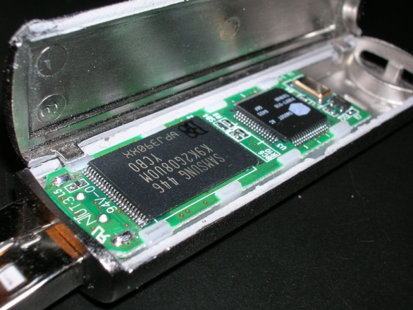
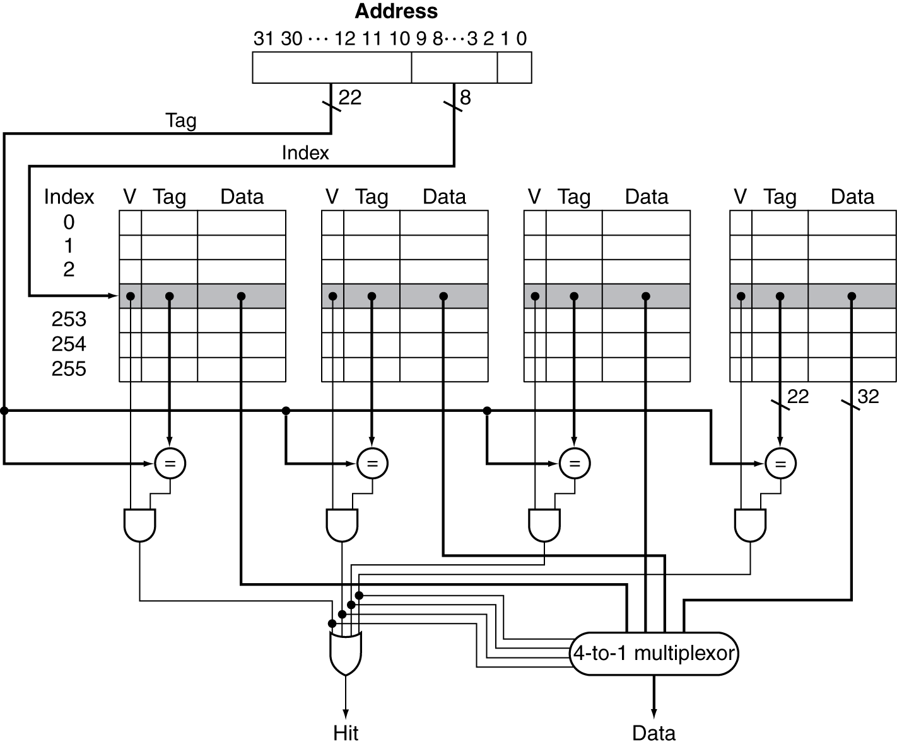

# Chapter 5

# Large and Fast: Exploiting Memory Hierarchy

# Principle of Locality

§5\.1 Introduction

* Programs access a small proportion of their address space at any time
* Temporal locality
  * Items accessed recently are likely to be accessed again soon
  * e\.g\.\, instructions in a loop\, induction variables
* Spatial locality
  * Items near those accessed recently are likely to be accessed soon
  * E\.g\.\, sequential instruction access\, array data

Chapter 5 — Large and Fast: Exploiting Memory Hierarchy —

# Taking Advantage of Locality

* Memory hierarchy
* Store everything on disk
* Copy recently accessed \(and nearby\) items from disk to smaller DRAM memory
  * Main memory
* Copy more recently accessed \(and nearby\) items from DRAM to smaller SRAM memory
  * Cache memory attached to CPU

Chapter 5 — Large and Fast: Exploiting Memory Hierarchy —

# Memory Hierarchy Levels

* Block \(aka line\): unit of copying
  * May be multiple words
* If accessed data is present in upper level
  * Hit: access satisfied by upper level
    * Hit ratio: hits/accesses
* If accessed data is absent
  * Miss: block copied from lower level
    * Time taken: miss penalty
    * Miss ratio: misses/accesses= 1 – hit ratio
  * Then accessed data supplied from upper level

Chapter 5 — Large and Fast: Exploiting Memory Hierarchy —

# Memory Technology

* Static RAM \(SRAM\)
  * 0\.5ns – 2\.5ns\, $500 – $1000 per GB
* Dynamic RAM \(DRAM\)
  * 50ns – 70ns\, $3 – $6 per GB
* Magnetic disk
  * 5ms – 20ms\, $0\.01 – $0\.02 per GB
* Ideal memory
  * Access time of SRAM
  * Capacity and cost/GB of disk

§5\.2 Memory Technologies

Chapter 5 — Large and Fast: Exploiting Memory Hierarchy —

# DRAM Technology

* Data stored as a charge in a capacitor
  * Single transistor used to access the charge
  * Must periodically be refreshed
    * Read contents and write back
    * Performed on a DRAM “row”

Chapter 5 — Large and Fast: Exploiting Memory Hierarchy —

# Advanced DRAM Organization

* Bits in a DRAM are organized as a rectangular array
  * DRAM accesses an entire row
  * Burst mode: supply successive words from a row with reduced latency
* Double data rate \(DDR\) DRAM
  * Transfer on rising and falling clock edges
* Quad data rate \(QDR\) DRAM
  * Separate DDR inputs and outputs

Chapter 5 — Large and Fast: Exploiting Memory Hierarchy —

# DRAM Generations

| Year | Capacity | $/GB |
| :-: | :-: | :-: |
| 1980 | 64 Kibibit  | $6\,480\,000  |
| 1983 | 256 Kibibit  | $1\,980\,000  |
| 1985 | 1 Mebibit  | $720\,000  |
| 1989 | 4 Mebibit  | $128\,000  |
| 1992 | 16 Mebibit  | $30\,000  |
| 1996 | 64 Mebibit  | $9\,000  |
| 1998 | 128 Mebibit  | $900  |
| 2000 | 256 Mebibit  | $840  |
| 2004 | 512 Mebibit  | $150  |
| 2007 | 1 Gibibit  | $40  |
| 2010 | 2 Gibibit  | $13  |
| 2012 | 4 Gibibit  | $5  |
| 2015 | 8 Gibibit  | $7  |
| 2018 | 16 Gibibit  | $6  |

Chapter 5 — Large and Fast: Exploiting Memory Hierarchy —

# DRAM Performance Factors

* Row buffer
  * Allows several words to be read and refreshed in parallel
* Synchronous DRAM
  * Allows for consecutive accesses in bursts without needing to send each address
  * Improves bandwidth
* DRAM banking
  * Allows simultaneous access to multiple DRAMs
  * Improves bandwidth

Chapter 5 — Large and Fast: Exploiting Memory Hierarchy —

# Increasing Memory Bandwidth

* 4\-word wide memory
  * Miss penalty = 1 \+ 15 \+ 1 = 17 bus cycles
  * Bandwidth = 16 bytes / 17 cycles = 0\.94 B/cycle
* 4\-bank interleaved memory
  * Miss penalty = 1 \+ 15 \+ 4×1 = 20 bus cycles
  * Bandwidth = 16 bytes / 20 cycles = 0\.8 B/cycle

Chapter 5 — Large and Fast: Exploiting Memory Hierarchy —

# Flash Storage

* Nonvolatile semiconductor storage
  * 100× – 1000× faster than disk
  * Smaller\, lower power\, more robust
  * But more $/GB \(between disk and DRAM\)

Chapter 6 — Storage and Other I/O Topics —

# Flash Types

* NOR flash: bit cell like a NOR gate
  * Random read/write access
  * Used for instruction memory in embedded systems
* NAND flash: bit cell like a NAND gate
  * Denser \(bits/area\)\, but block\-at\-a\-time access
  * Cheaper per GB
  * Used for USB keys\, media storage\, …
* Flash bits wears out after 1000’s of accesses
  * Not suitable for direct RAM or disk replacement
  * Wear leveling: remap data to less used blocks

Chapter 6 — Storage and Other I/O Topics —

# Disk Storage

Nonvolatile\, rotating magnetic storage

Chapter 6 — Storage and Other I/O Topics —

# Disk Sectors and Access

* Each sector records
  * Sector ID
  * Data \(512 bytes\, 4096 bytes proposed\)
  * Error correcting code \(ECC\)
    * Used to hide defects and recording errors
  * Synchronization fields and gaps
* Access to a sector involves
  * Queuing delay if other accesses are pending
  * Seek: move the heads
  * Rotational latency
  * Data transfer
  * Controller overhead

Chapter 6 — Storage and Other I/O Topics —

# Disk Access Example

* Given
  * 512B sector\, 15\,000rpm\, 4ms average seek time\, 100MB/s transfer rate\, 0\.2ms controller overhead\, idle disk
* Average read time
  * 4ms seek time\+ ½ / \(15\,000/60\) = 2ms rotational latency\+ 512 / 100MB/s = 0\.005ms transfer time\+ 0\.2ms controller delay= 6\.2ms
* If actual average seek time is 1ms
  * Average read time = 3\.2ms

Chapter 6 — Storage and Other I/O Topics —

# Disk Performance Issues

* Manufacturers quote average seek time
  * Based on all possible seeks
  * Locality and OS scheduling lead to smaller actual average seek times
* Smart disk controller allocate physical sectors on disk
  * Present logical sector interface to host
  * SCSI\, ATA\, SATA
* Disk drives include caches
  * Prefetch sectors in anticipation of access
  * Avoid seek and rotational delay

Chapter 6 — Storage and Other I/O Topics —

# Cache Memory

* Cache memory
  * The level of the memory hierarchy closest to the CPU
* Given accesses X1\, …\, Xn–1\, Xn

§5\.3 The Basics of Caches

How do we know if the data is present?

Where do we look?

Chapter 5 — Large and Fast: Exploiting Memory Hierarchy —

# Direct Mapped Cache

* Location determined by address
* Direct mapped: only one choice
  * \(Block address\) modulo \(\#Blocks in cache\)

\#Blocks is a power of 2

Use low\-order address bits

Chapter 5 — Large and Fast: Exploiting Memory Hierarchy —

# Tags and Valid Bits

* How do we know which particular block is stored in a cache location?
  * Store block address as well as the data
  * Actually\, only need the high\-order bits
  * Called the tag
* What if there is no data in a location?
  * Valid bit: 1 = present\, 0 = not present
  * Initially 0

Chapter 5 — Large and Fast: Exploiting Memory Hierarchy —

# Cache Example

8\-blocks\, 1 word/block\, direct mapped

Initial state

| Index | V | Tag | Data |
| :-: | :-: | :-: | :-: |
| 000 | N |  |  |
| 001 | N |  |  |
| 010 | N |  |  |
| 011 | N |  |  |
| 100 | N |  |  |
| 101 | N |  |  |
| 110 | N |  |  |
| 111 | N |  |  |

Chapter 5 — Large and Fast: Exploiting Memory Hierarchy —

| Word addr | Binary addr | Hit/miss | Cache block |
| :-: | :-: | :-: | :-: |
| 22 | 10 110 | Miss | 110 |

| Index | V | Tag | Data |
| :-: | :-: | :-: | :-: |
| 000 | N |  |  |
| 001 | N |  |  |
| 010 | N |  |  |
| 011 | N |  |  |
| 100 | N |  |  |
| 101 | N |  |  |
| __110__ | __Y__ | __10__ | __Mem\[10110\]__ |
| 111 | N |  |  |

Chapter 5 — Large and Fast: Exploiting Memory Hierarchy —

| Word addr | Binary addr | Hit/miss | Cache block |
| :-: | :-: | :-: | :-: |
| 26 | 11 010 | Miss | 010 |

| Index | V | Tag | Data |
| :-: | :-: | :-: | :-: |
| 000 | N |  |  |
| 001 | N |  |  |
| __010__ | __Y__ | __11__ | __Mem\[11010\]__ |
| 011 | N |  |  |
| 100 | N |  |  |
| 101 | N |  |  |
| 110 | Y | 10 | Mem\[10110\] |
| 111 | N |  |  |

Chapter 5 — Large and Fast: Exploiting Memory Hierarchy —

| Word addr | Binary addr | Hit/miss | Cache block |
| :-: | :-: | :-: | :-: |
| 22 | 10 110 | Hit | 110 |
| 26 | 11 010 | Hit | 010 |

| Index | V | Tag | Data |
| :-: | :-: | :-: | :-: |
| 000 | N |  |  |
| 001 | N |  |  |
| 010 | Y | 11 | Mem\[11010\] |
| 011 | N |  |  |
| 100 | N |  |  |
| 101 | N |  |  |
| 110 | Y | 10 | Mem\[10110\] |
| 111 | N |  |  |

Chapter 5 — Large and Fast: Exploiting Memory Hierarchy —

| Word addr | Binary addr | Hit/miss | Cache block |
| :-: | :-: | :-: | :-: |
| 16 | 10 000 | Miss | 000 |
| 3 | 00 011 | Miss | 011 |
| 16 | 10 000 | Hit | 000 |

| Index | V | Tag | Data |
| :-: | :-: | :-: | :-: |
| __000__ | __Y__ | __10__ | __Mem\[10000\]__ |
| 001 | N |  |  |
| 010 | Y | 11 | Mem\[11010\] |
| __011__ | __Y__ | __00__ | __Mem\[00011\]__ |
| 100 | N |  |  |
| 101 | N |  |  |
| 110 | Y | 10 | Mem\[10110\] |
| 111 | N |  |  |

Chapter 5 — Large and Fast: Exploiting Memory Hierarchy —

| Word addr | Binary addr | Hit/miss | Cache block |
| :-: | :-: | :-: | :-: |
| 18 | 10 010 | Miss | 010 |

| Index | V | Tag | Data |
| :-: | :-: | :-: | :-: |
| 000 | Y | 10 | Mem\[10000\] |
| 001 | N |  |  |
|  __010__  |  __Y__  |  __10__  |  __Mem\[10010\]__  |
| 011 | Y | 00 | Mem\[00011\] |
| 100 | N |  |  |
| 101 | N |  |  |
| 110 | Y | 10 | Mem\[10110\] |
| 111 | N |  |  |

Chapter 5 — Large and Fast: Exploiting Memory Hierarchy —

# Address Subdivision

Chapter 5 — Large and Fast: Exploiting Memory Hierarchy —

# Example: Larger Block Size

* 64 blocks\, 16 bytes/block
  * To what block number does address 1200 map?
* Block address = 1200/16 = 75
* Block number = 75 modulo 64 = 11

Chapter 5 — Large and Fast: Exploiting Memory Hierarchy —

# Block Size Considerations

* Larger blocks should reduce miss rate
  * Due to spatial locality
* But in a fixed\-sized cache
  * Larger blocks  fewer of them
    * More competition  increased miss rate
  * Larger blocks  pollution
* Larger miss penalty
  * Can override benefit of reduced miss rate
  * Early restart and critical\-word\-first can help

Chapter 5 — Large and Fast: Exploiting Memory Hierarchy —

# Cache Misses

* On cache hit\, CPU proceeds normally
* On cache miss
  * Stall the CPU pipeline
  * Fetch block from next level of hierarchy
  * Instruction cache miss
    * Restart instruction fetch
  * Data cache miss
    * Complete data access

Chapter 5 — Large and Fast: Exploiting Memory Hierarchy —

# Write-Through

* On data\-write hit\, could just update the block in cache
  * But then cache and memory would be inconsistent
* Write through: also update memory
* But makes writes take longer
  * e\.g\.\, if base CPI = 1\, 10% of instructions are stores\, write to memory takes 100 cycles
    * Effective CPI = 1 \+ 0\.1×100 = 11
* Solution: write buffer
  * Holds data waiting to be written to memory
  * CPU continues immediately
    * Only stalls on write if write buffer is already full

Chapter 5 — Large and Fast: Exploiting Memory Hierarchy —

# Write-Back

* Alternative: On data\-write hit\, just update the block in cache
  * Keep track of whether each block is dirty
* When a dirty block is replaced
  * Write it back to memory
  * Can use a write buffer to allow replacing block to be read first

Chapter 5 — Large and Fast: Exploiting Memory Hierarchy —

# Write Allocation

* What should happen on a write miss?
* Alternatives for write\-through
  * Allocate on miss: fetch the block
  * Write around: don’t fetch the block
    * Since programs often write a whole block before reading it \(e\.g\.\, initialization\)
* For write\-back
  * Usually fetch the block

Chapter 5 — Large and Fast: Exploiting Memory Hierarchy —

# Example: Intrinsity FastMATH

* Embedded MIPS processor
  * 12\-stage pipeline
  * Instruction and data access on each cycle
* Split cache: separate I\-cache and D\-cache
  * Each 16KB: 256 blocks × 16 words/block
  * D\-cache: write\-through or write\-back
* SPEC2000 miss rates
  * I\-cache: 0\.4%
  * D\-cache: 11\.4%
  * Weighted average: 3\.2%

Chapter 5 — Large and Fast: Exploiting Memory Hierarchy —

Chapter 5 — Large and Fast: Exploiting Memory Hierarchy —

# Main Memory Supporting Caches

* Use DRAMs for main memory
  * Fixed width \(e\.g\.\, 1 word\)
  * Connected by fixed\-width clocked bus
    * Bus clock is typically slower than CPU clock
* Example cache block read
  * 1 bus cycle for address transfer
  * 15 bus cycles per DRAM access
  * 1 bus cycle per data transfer
* For 4\-word block\, 1\-word\-wide DRAM
  * Miss penalty = 1 \+ 4×15 \+ 4×1 = 65 bus cycles
  * Bandwidth = 16 bytes / 65 cycles = 0\.25 B/cycle

Chapter 5 — Large and Fast: Exploiting Memory Hierarchy —

# Measuring Cache Performance

* Components of CPU time
  * Program execution cycles
    * Includes cache hit time
  * Memory stall cycles
    * Mainly from cache misses
* With simplifying assumptions:

§5\.4 Measuring and Improving Cache Performance

Chapter 5 — Large and Fast: Exploiting Memory Hierarchy —

# Cache Performance Example

* Given
  * I\-cache miss rate = 2%
  * D\-cache miss rate = 4%
  * Miss penalty = 100 cycles
  * Base CPI \(ideal cache\) = 2
  * Load & stores are 36% of instructions
* Miss cycles per instruction
  * I\-cache: 0\.02 × 100 = 2
  * D\-cache: 0\.36 × 0\.04 × 100 = 1\.44
* Actual CPI = 2 \+ 2 \+ 1\.44 = 5\.44
  * Ideal CPU is 5\.44/2 =2\.72 times faster

Chapter 5 — Large and Fast: Exploiting Memory Hierarchy —

# Average Access Time

* Hit time is also important for performance
* Average memory access time \(AMAT\)
  * AMAT = Hit time \+ Miss rate × Miss penalty
* Example
  * CPU with 1ns clock\, hit time = 1 cycle\, miss penalty = 20 cycles\, I\-cache miss rate = 5%
  * AMAT = 1 \+ 0\.05 × 20 = 2ns
    * 2 cycles per instruction

Chapter 5 — Large and Fast: Exploiting Memory Hierarchy —

# Performance Summary

* When CPU performance increased
  * Miss penalty becomes more significant
* Decreasing base CPI
  * Greater proportion of time spent on memory stalls
* Increasing clock rate
  * Memory stalls account for more CPU cycles
* Can’t neglect cache behavior when evaluating system performance

Chapter 5 — Large and Fast: Exploiting Memory Hierarchy —

# Associative Caches

* Fully associative
  * Allow a given block to go in any cache entry
  * Requires all entries to be searched at once
  * Comparator per entry \(expensive\)
* _n_ \-way set associative
  * Each set contains  _n_  entries
  * Block number determines which set
    * \(Block number\) modulo \(\#Sets in cache\)
  * Search all entries in a given set at once
  * _n_  comparators \(less expensive\)

Chapter 5 — Large and Fast: Exploiting Memory Hierarchy —

# Associative Cache Example

Chapter 5 — Large and Fast: Exploiting Memory Hierarchy —

# Spectrum of Associativity

For a cache with 8 entries

Chapter 5 — Large and Fast: Exploiting Memory Hierarchy —

# Associativity Example

* Compare 4\-block caches
  * Direct mapped\, 2\-way set associative\,fully associative
  * Block access sequence: 0\, 8\, 0\, 6\, 8
* Direct mapped

| Block address | Cache index | Hit/miss | Cache content after access |  |  |  |
| :-: | :-: | :-: | :-: | :-: | :-: | :-: |
|  |  |  | 0 | 1 | 2 | 3 |
| 0 | 0 | miss | __Mem\[0\]__ |  |  |  |
| 8 | 0 | miss |  __Mem\[8\]__  |  |  |  |
| 0 | 0 | miss |  __Mem\[0\]__  |  |  |  |
| 6 | 2 | miss | Mem\[0\] |  | __Mem\[6\]__ |  |
| 8 | 0 | miss |  __Mem\[8\]__  |  | Mem\[6\] |  |

Chapter 5 — Large and Fast: Exploiting Memory Hierarchy —

2\-way set associative

| Block address | Cache index | Hit/miss | Cache content after access |  |  |  |
| :-: | :-: | :-: | :-: | :-: | :-: | :-: |
|  |  |  | Set 0 |  | Set 1 |  |
| 0 | 0 | miss | __Mem\[0\]__ |  |  |  |
| 8 | 0 | miss | Mem\[0\] | __Mem\[8\]__ |  |  |
| 0 | 0 | hit |  __Mem\[0\]__  | Mem\[8\] |  |  |
| 6 | 0 | miss | Mem\[0\] |  __Mem\[6\]__  |  |  |
| 8 | 0 | miss |  __Mem\[8\]__  | Mem\[6\] |  |  |

Fully associative

| Block address |  | Hit/miss | Cache content after access |  |  |  |
| :-: | :-: | :-: | :-: | :-: | :-: | :-: |
| 0 |  | miss | _Mem\[0\]_ |  |  |  |
| 8 |  | miss | Mem\[0\] | _Mem\[8\]_ |  |  |
| 0 |  | hit |  __Mem\[0\]__  | Mem\[8\] |  |  |
| 6 |  | miss | Mem\[0\] | Mem\[8\] | _Mem\[6\]_ |  |
| 8 |  | hit | Mem\[0\] |  __Mem\[8\]__  | Mem\[6\] |  |

Chapter 5 — Large and Fast: Exploiting Memory Hierarchy —

# How Much Associativity

* Increased associativity decreases miss rate
  * But with diminishing returns
* Simulation of a system with 64KBD\-cache\, 16\-word blocks\, SPEC2000
  * 1\-way: 10\.3%
  * 2\-way: 8\.6%
  * 4\-way: 8\.3%
  * 8\-way: 8\.1%

Chapter 5 — Large and Fast: Exploiting Memory Hierarchy —

# Set Associative Cache Organization

Chapter 5 — Large and Fast: Exploiting Memory Hierarchy —

# Replacement Policy

* Direct mapped: no choice
* Set associative
  * Prefer non\-valid entry\, if there is one
  * Otherwise\, choose among entries in the set
* Least\-recently used \(LRU\)
  * Choose the one unused for the longest time
    * Simple for 2\-way\, manageable for 4\-way\, too hard beyond that
* Random
  * Gives approximately the same performance as LRU for high associativity

Chapter 5 — Large and Fast: Exploiting Memory Hierarchy —

# Multilevel Caches

* Primary cache attached to CPU
  * Small\, but fast
* Level\-2 cache services misses from primary cache
  * Larger\, slower\, but still faster than main memory
* Main memory services L\-2 cache misses
* Some high\-end systems include L\-3 cache

Chapter 5 — Large and Fast: Exploiting Memory Hierarchy —

# Multilevel Cache Example

* Given
  * CPU base CPI = 1\, clock rate = 4GHz
  * Miss rate/instruction = 2%
  * Main memory access time = 100ns
* With just primary cache
  * Miss penalty = 100ns/0\.25ns = 400 cycles
  * Effective CPI = 1 \+ 0\.02 × 400 = 9

Chapter 5 — Large and Fast: Exploiting Memory Hierarchy —

# Example (cont.)

* Now add L\-2 cache
  * Access time = 5ns
  * Global miss rate to main memory = 0\.5%
* Primary miss with L\-2 hit
  * Penalty = 5ns/0\.25ns = 20 cycles
* Primary miss with L\-2 miss
  * Extra penalty = 500 cycles
* CPI = 1 \+ 0\.02 × 20 \+ 0\.005 × 400 = 3\.4
* Performance ratio = 9/3\.4 = 2\.6

Chapter 5 — Large and Fast: Exploiting Memory Hierarchy —

# Multilevel Cache Considerations

* Primary cache
  * Focus on minimal hit time
* L\-2 cache
  * Focus on low miss rate to avoid main memory access
  * Hit time has less overall impact
* Results
  * L\-1 cache usually smaller than a single cache
  * L\-1 block size smaller than L\-2 block size

Chapter 5 — Large and Fast: Exploiting Memory Hierarchy —

# Interactions with Advanced CPUs

* Out\-of\-order CPUs can execute instructions during cache miss
  * Pending store stays in load/store unit
  * Dependent instructions wait in reservation stations
    * Independent instructions continue
* Effect of miss depends on program data flow
  * Much harder to analyse
  * Use system simulation

Chapter 5 — Large and Fast: Exploiting Memory Hierarchy —

# Interactions with Software

* Misses depend on memory access patterns
  * Algorithm behavior
  * Compiler optimization for memory access

Chapter 5 — Large and Fast: Exploiting Memory Hierarchy —

# Software Optimization via Blocking

Goal:  maximize accesses to data before it is replaced

Consider inner loops of DGEMM:

for \(int j = 0; j < n; \+\+j\)

\{

double cij = C\[i\+j\*n\];

for\( int k = 0; k < n; k\+\+ \)

cij \+= A\[i\+k\*n\] \* B\[k\+j\*n\];

C\[i\+j\*n\] = cij;

\}

Chapter 5 — Large and Fast: Exploiting Memory Hierarchy —

# DGEMM Access Pattern

C\, A\, and B arrays

Chapter 5 — Large and Fast: Exploiting Memory Hierarchy —

# Cache Blocked DGEMM

1 \#define BLOCKSIZE 32

2 void do\_block \(int n\, int si\, int sj\, int sk\, double \*A\, double

3 \*B\, double \*C\)

4 \{

5  for \(int i = si; i < si\+BLOCKSIZE; \+\+i\)

6   for \(int j = sj; j < sj\+BLOCKSIZE; \+\+j\)

7   \{

8    double cij = C\[i\+j\*n\];/\* cij = C\[i\]\[j\] \*/

9    for\( int k = sk; k < sk\+BLOCKSIZE; k\+\+ \)

10    cij \+= A\[i\+k\*n\] \* B\[k\+j\*n\];/\* cij\+=A\[i\]\[k\]\*B\[k\]\[j\] \*/

11   C\[i\+j\*n\] = cij;/\* C\[i\]\[j\] = cij \*/

12  \}

13 \}

14 void dgemm \(int n\, double\* A\, double\* B\, double\* C\)

15 \{

16  for \( int sj = 0; sj < n; sj \+= BLOCKSIZE \)

17   for \( int si = 0; si < n; si \+= BLOCKSIZE \)

18    for \( int sk = 0; sk < n; sk \+= BLOCKSIZE \)

19     do\_block\(n\, si\, sj\, sk\, A\, B\, C\);

20 \}

Chapter 5 — Large and Fast: Exploiting Memory Hierarchy —

# Blocked DGEMM Access Pattern

Chapter 5 — Large and Fast: Exploiting Memory Hierarchy —

# Dependability

_Service accomplishment_

Service deliveredas specified

§5\.5 Dependable Memory Hierarchy

* Fault: failure of a component
  * May or may not lead to system failure

_Service interruption_

Deviation fromspecified service

Chapter 6 — Storage and Other I/O Topics —

# Dependability Measures

* Reliability: mean time to failure \(MTTF\)
* Service interruption: mean time to repair \(MTTR\)
* Mean time between failures
  * MTBF = MTTF \+ MTTR
* Availability = MTTF / \(MTTF \+ MTTR\)
* Improving Availability
  * Increase MTTF: fault avoidance\, fault tolerance\, fault forecasting
  * Reduce MTTR: improved tools and processes for diagnosis and repair

Chapter 6 — Storage and Other I/O Topics —

# The Hamming SEC Code

* Hamming distance
  * Number of bits that are different between two bit patterns
* Minimum distance = 2 provides single bit error detection
  * E\.g\. parity code
* Minimum distance = 3 provides single error correction\, 2 bit error detection

Chapter 5 — Large and Fast: Exploiting Memory Hierarchy —

# Encoding SEC

* To calculate Hamming code:
  * Number bits from 1 on the left
  * All bit positions that are a power 2 are parity bits
  * Each parity bit checks certain data bits:

Chapter 5 — Large and Fast: Exploiting Memory Hierarchy —

# Decoding SEC

* Value of parity bits indicates which bits are in error
  * Use numbering from encoding procedure
  * E\.g\.
    * Parity bits = 0000 indicates no error
    * Parity bits = 1010 indicates bit 10 was flipped

Chapter 5 — Large and Fast: Exploiting Memory Hierarchy —

# SEC/DEC Code

* Add an additional parity bit for the whole word \(pn\)
* Make Hamming distance = 4
* Decoding:
  * Let H = SEC parity bits
    * H even\, pn even\, no error
    * H odd\, pn odd\, correctable single bit error
    * H even\, pn odd\, error in pn bit
    * H odd\, pn even\, double error occurred
* Note:  ECC DRAM uses SEC/DEC with 8 bits protecting each 64 bits

Chapter 5 — Large and Fast: Exploiting Memory Hierarchy —

# Virtual Machines

§5\.6 Virtual Machines

* Host computer emulates guest operating system and machine resources
  * Improved isolation of multiple guests
  * Avoids security and reliability problems
  * Aids sharing of resources
* Virtualization has some performance impact
  * Feasible with modern high\-performance comptuers
* Examples
  * IBM VM/370 \(1970s technology\!\)
  * VMWare
  * Microsoft Virtual PC

Chapter 5 — Large and Fast: Exploiting Memory Hierarchy —

# Virtual Machine Monitor

* Maps virtual resources to physical resources
  * Memory\, I/O devices\, CPUs
* Guest code runs on native machine in user mode
  * Traps to VMM on privileged instructions and access to protected resources
* Guest OS may be different from host OS
* VMM handles real I/O devices
  * Emulates generic virtual I/O devices for guest

Chapter 5 — Large and Fast: Exploiting Memory Hierarchy —

# Example: Timer Virtualization

* In native machine\, on timer interrupt
  * OS suspends current process\, handles interrupt\, selects and resumes next process
* With Virtual Machine Monitor
  * VMM suspends current VM\, handles interrupt\, selects and resumes next VM
* If a VM requires timer interrupts
  * VMM emulates a virtual timer
  * Emulates interrupt for VM when physical timer interrupt occurs

Chapter 5 — Large and Fast: Exploiting Memory Hierarchy —

# Instruction Set Support

* User and System modes
* Privileged instructions only available in system mode
  * Trap to system if executed in user mode
* All physical resources only accessible using privileged instructions
  * Including page tables\, interrupt controls\, I/O registers
* Renaissance of virtualization support
  * Current ISAs \(e\.g\.\, x86\) adapting

Chapter 5 — Large and Fast: Exploiting Memory Hierarchy —

# Virtual Memory

§5\.7 Virtual Memory

* Use main memory as a “cache” for secondary \(disk\) storage
  * Managed jointly by CPU hardware and the operating system \(OS\)
* Programs share main memory
  * Each gets a private virtual address space holding its frequently used code and data
  * Protected from other programs
* CPU and OS translate virtual addresses to physical addresses
  * VM “block” is called a page
  * VM translation “miss” is called a page fault

Chapter 5 — Large and Fast: Exploiting Memory Hierarchy —

# Address Translation

Fixed\-size pages \(e\.g\.\, 4K\)

Chapter 5 — Large and Fast: Exploiting Memory Hierarchy —

# Page Fault Penalty

* On page fault\, the page must be fetched from disk
  * Takes millions of clock cycles
  * Handled by OS code
* Try to minimize page fault rate
  * Fully associative placement
  * Smart replacement algorithms

Chapter 5 — Large and Fast: Exploiting Memory Hierarchy —

# Page Tables

* Stores placement information
  * Array of page table entries\, indexed by virtual page number
  * Page table register in CPU points to page table in physical memory
* If page is present in memory
  * PTE stores the physical page number
  * Plus other status bits \(referenced\, dirty\, …\)
* If page is not present
  * PTE can refer to location in swap space on disk

Chapter 5 — Large and Fast: Exploiting Memory Hierarchy —

# Translation Using a Page Table

Chapter 5 — Large and Fast: Exploiting Memory Hierarchy —

# Mapping Pages to Storage

Chapter 5 — Large and Fast: Exploiting Memory Hierarchy —

# Replacement and Writes

* To reduce page fault rate\, prefer least\-recently used \(LRU\) replacement
  * Reference bit \(aka use bit\) in PTE set to 1 on access to page
  * Periodically cleared to 0 by OS
  * A page with reference bit = 0 has not been used recently
* Disk writes take millions of cycles
  * Block at once\, not individual locations
  * Write through is impractical
  * Use write\-back
  * Dirty bit in PTE set when page is written

Chapter 5 — Large and Fast: Exploiting Memory Hierarchy —

# Fast Translation Using a TLB

* Address translation would appear to require extra memory references
  * One to access the PTE
  * Then the actual memory access
* But access to page tables has good locality
  * So use a fast cache of PTEs within the CPU
  * Called a Translation Look\-aside Buffer \(TLB\)
  * Typical: 16–512 PTEs\, 0\.5–1 cycle for hit\, 10–100 cycles for miss\, 0\.01%–1% miss rate
  * Misses could be handled by hardware or software

Chapter 5 — Large and Fast: Exploiting Memory Hierarchy —

Chapter 5 — Large and Fast: Exploiting Memory Hierarchy —

# TLB Misses

* If page is in memory
  * Load the PTE from memory and retry
  * Could be handled in hardware
    * Can get complex for more complicated page table structures
  * Or in software
    * Raise a special exception\, with optimized handler
* If page is not in memory \(page fault\)
  * OS handles fetching the page and updating the page table
  * Then restart the faulting instruction

Chapter 5 — Large and Fast: Exploiting Memory Hierarchy —

# TLB Miss Handler

* TLB miss indicates
  * Page present\, but PTE not in TLB
  * Page not preset
* Must recognize TLB miss before destination register overwritten
  * Raise exception
* Handler copies PTE from memory to TLB
  * Then restarts instruction
  * If page not present\, page fault will occur

Chapter 5 — Large and Fast: Exploiting Memory Hierarchy —

# Page Fault Handler

* Use faulting virtual address to find PTE
* Locate page on disk
* Choose page to replace
  * If dirty\, write to disk first
* Read page into memory and update page table
* Make process runnable again
  * Restart from faulting instruction

Chapter 5 — Large and Fast: Exploiting Memory Hierarchy —

# TLB and Cache Interaction

* If cache tag uses physical address
  * Need to translate before cache lookup
* Alternative: use virtual address tag
  * Complications due to aliasing
    * Different virtual addresses for shared physical address

Chapter 5 — Large and Fast: Exploiting Memory Hierarchy —

# Memory Protection

* Different tasks can share parts of their virtual address spaces
  * But need to protect against errant access
  * Requires OS assistance
* Hardware support for OS protection
  * Privileged supervisor mode \(aka kernel mode\)
  * Privileged instructions
  * Page tables and other state information only accessible in supervisor mode
  * System call exception \(e\.g\.\, ecall in RISC\-V\)

Chapter 5 — Large and Fast: Exploiting Memory Hierarchy —

# The Memory Hierarchy

* Common principles apply at all levels of the memory hierarchy
  * Based on notions of caching
* At each level in the hierarchy
  * Block placement
  * Finding a block
  * Replacement on a miss
  * Write policy

§5\.8 A Common Framework for Memory Hierarchies

Chapter 5 — Large and Fast: Exploiting Memory Hierarchy —

# Block Placement

* Determined by associativity
  * Direct mapped \(1\-way associative\)
    * One choice for placement
  * n\-way set associative
    * n choices within a set
  * Fully associative
    * Any location
* Higher associativity reduces miss rate
  * Increases complexity\, cost\, and access time

Chapter 5 — Large and Fast: Exploiting Memory Hierarchy —

# Finding a Block

| Associativity | Location method | Tag comparisons |
| :-: | :-: | :-: |
| Direct mapped | Index | 1 |
| n\-way set associative | Set index\, then search entries within the set | n |
| Fully associative | Search all entries | \#entries |
|  | Full lookup table | 0 |

* Hardware caches
  * Reduce comparisons to reduce cost
* Virtual memory
  * Full table lookup makes full associativity feasible
  * Benefit in reduced miss rate

Chapter 5 — Large and Fast: Exploiting Memory Hierarchy —

# Replacement

* Choice of entry to replace on a miss
  * Least recently used \(LRU\)
    * Complex and costly hardware for high associativity
  * Random
    * Close to LRU\, easier to implement
* Virtual memory
  * LRU approximation with hardware support

Chapter 5 — Large and Fast: Exploiting Memory Hierarchy —

# Write Policy

* Write\-through
  * Update both upper and lower levels
  * Simplifies replacement\, but may require write buffer
* Write\-back
  * Update upper level only
  * Update lower level when block is replaced
  * Need to keep more state
* Virtual memory
  * Only write\-back is feasible\, given disk write latency

Chapter 5 — Large and Fast: Exploiting Memory Hierarchy —

# Sources of Misses

* Compulsory misses \(aka cold start misses\)
  * First access to a block
* Capacity misses
  * Due to finite cache size
  * A replaced block is later accessed again
* Conflict misses \(aka collision misses\)
  * In a non\-fully associative cache
  * Due to competition for entries in a set
  * Would not occur in a fully associative cache of the same total size

Chapter 5 — Large and Fast: Exploiting Memory Hierarchy —

# Cache Design Trade-offs

| Design change | Effect on miss rate | Negative performance effect |
| :-: | :-: | :-: |
| Increase cache size | Decrease capacity misses | May increase access time |
| Increase associativity | Decrease conflict misses | May increase access time |
| Increase block size | Decrease compulsory misses | Increases miss penalty\. For very large block size\, may increase miss rate due to pollution\. |

Chapter 5 — Large and Fast: Exploiting Memory Hierarchy —

# Cache Control

* Example cache characteristics
  * Direct\-mapped\, write\-back\, write allocate
  * Block size: 4 words \(16 bytes\)
  * Cache size: 16 KB \(1024 blocks\)
  * 32\-bit byte addresses
  * Valid bit and dirty bit per block
  * Blocking cache
    * CPU waits until access is complete

§5\.9 Using a Finite\-State Machine to Control A Simple Cache

Chapter 5 — Large and Fast: Exploiting Memory Hierarchy —

# Interface Signals

Multiple cycles per access

Chapter 5 — Large and Fast: Exploiting Memory Hierarchy —

# Finite State Machines

* Use an FSM to sequence control steps
* Set of states\, transition on each clock edge
  * State values are binary encoded
  * Current state stored in a register
  * Next state=  _f_  _n_  \(current state\,		current inputs\)
* Control output signals=  _f_  _o_  \(current state\)

Chapter 5 — Large and Fast: Exploiting Memory Hierarchy —

# Cache Controller FSM

Could partition into separate states to reduce clock cycle time

Chapter 5 — Large and Fast: Exploiting Memory Hierarchy —

# Cache Coherence Problem

* Suppose two CPU cores share a physical address space
  * Write\-through caches

| Time step | Event | CPU A’s cache | CPU B’s cache | Memory |
| :-: | :-: | :-: | :-: | :-: |
| 0 |  |  |  | 0 |
| 1 | CPU A reads X | 0 |  | 0 |
| 2 | CPU B reads X | 0 | 0 | 0 |
| 3 | CPU A writes 1 to X | 1 | 0 | 1 |

§5\.10 Parallelism and Memory Hierarchies: Cache Coherence

Chapter 5 — Large and Fast: Exploiting Memory Hierarchy —

# Coherence Defined

* Informally: Reads return most recently written value
* Formally:
  * P writes X; P reads X \(no intervening writes\) read returns written value
  * P1 writes X; P2 reads X \(sufficiently later\) read returns written value
    * c\.f\. CPU B reading X after step 3 in example
  * P1 writes X\, P2 writes X all processors see writes in the same order
    * End up with the same final value for X

Chapter 5 — Large and Fast: Exploiting Memory Hierarchy —

# Cache Coherence Protocols

* Operations performed by caches in multiprocessors to ensure coherence
  * Migration of data to local caches
    * Reduces bandwidth for shared memory
  * Replication of read\-shared data
    * Reduces contention for access
* Snooping protocols
  * Each cache monitors bus reads/writes
* Directory\-based protocols
  * Caches and memory record sharing status of blocks in a directory

Chapter 5 — Large and Fast: Exploiting Memory Hierarchy —

# Invalidating Snooping Protocols

* Cache gets exclusive access to a block when it is to be written
  * Broadcasts an invalidate message on the bus
  * Subsequent read in another cache misses
    * Owning cache supplies updated value

| CPU activity | Bus activity | CPU A’s cache | CPU B’s cache | Memory |
| :-: | :-: | :-: | :-: | :-: |
|  |  |  |  | 0 |
| CPU A reads X | Cache miss for X | 0 |  | 0 |
| CPU B reads X | Cache miss for X | 0 | 0 | 0 |
| CPU A writes 1 to X | Invalidate for X | 1 |  | 0 |
| CPU B read X | Cache miss for X | 1 | 1 | 1 |

Chapter 5 — Large and Fast: Exploiting Memory Hierarchy —

# Memory Consistency

* When are writes seen by other processors
  * “Seen” means a read returns the written value
  * Can’t be instantaneously
* Assumptions
  * A write completes only when all processors have seen it
  * A processor does not reorder writes with other accesses
* Consequence
  * P writes X then writes Y all processors that see new Y also see new X
  * Processors can reorder reads\, but not writes

Chapter 5 — Large and Fast: Exploiting Memory Hierarchy —

# Multilevel On-Chip Caches

§5\.13 The ARM Cortex\-A53 and Intel Core i7 Memory Hierarchies

Chapter 5 — Large and Fast: Exploiting Memory Hierarchy —

# 2-Level TLB Organization

Chapter 5 — Large and Fast: Exploiting Memory Hierarchy —

# Supporting Multiple Issue

* Both have multi\-banked caches that allow multiple accesses per cycle assuming no bank conflicts
* Other optimizations
  * Return requested word first
  * Non\-blocking cache
    * Hit under miss
    * Miss under miss
  * Data prefetching

Chapter 5 — Large and Fast: Exploiting Memory Hierarchy —

# RISC-V System Instructions

| Type | Mnemonic | Name |
| :-: | :-: | :-: |
| Mem ordering | fence\.i | Instruction fence |
|  | fence | Fence |
|  | sfence\.vm | Address translation fence |
| CSR access | csrrwi | CSR read/write immediate |
|  | csrrsi | CSR read/set immediate |
|  | csrrci | CSR read/clear immediate |
|  | csrrw | CSR read/write |
|  | csrrs | CSR read/set |
|  | csrrc | CSR read/clear |
| System | ecall | Environment call |
|  | ebreak | Environment breakpoint |
|  | sret | Supervisor exception return |
|  | wfi | Wait for interrupt |

§5\.14 Real Stuff: RISC\-V System and Special Instructions

Chapter 5 — Large and Fast: Exploiting Memory Hierarchy —

# DGEMM

Combine cache blocking and subword parallelism

§5\.15 Going Faster:  Cache Blocking and Matrix Multiply

Chapter 5 — Large and Fast: Exploiting Memory Hierarchy —

# Pitfalls

* Byte vs\. word addressing
  * Example: 32\-byte direct\-mapped cache\,4\-byte blocks
    * Byte 36 maps to block 1
    * Word 36 maps to block 4
* Ignoring memory system effects when writing or generating code
  * Example: iterating over rows vs\. columns of arrays
  * Large strides result in poor locality

§5\.16 Fallacies and Pitfalls

Chapter 5 — Large and Fast: Exploiting Memory Hierarchy —

* In multiprocessor with shared L2 or L3 cache
  * Less associativity than cores results in conflict misses
  * More cores  need to increase associativity
* Using AMAT to evaluate performance of out\-of\-order processors
  * Ignores effect of non\-blocked accesses
  * Instead\, evaluate performance by simulation

Chapter 5 — Large and Fast: Exploiting Memory Hierarchy —

* Extending address range using segments
  * E\.g\.\, Intel 80286
  * But a segment is not always big enough
  * Makes address arithmetic complicated
* Implementing a VMM on an ISA not designed for virtualization
  * E\.g\.\, non\-privileged instructions accessing hardware resources
  * Either extend ISA\, or require guest OS not to use problematic instructions

Chapter 5 — Large and Fast: Exploiting Memory Hierarchy —

# Concluding Remarks

* Fast memories are small\, large memories are slow
  * We really want fast\, large memories 
  * Caching gives this illusion 
* Principle of locality
  * Programs use a small part of their memory space frequently
* Memory hierarchy
  * L1 cache  L2 cache  …  DRAM memory disk
* Memory system design is critical for multiprocessors

§5\.17 Concluding Remarks

Chapter 5 — Large and Fast: Exploiting Memory Hierarchy —

