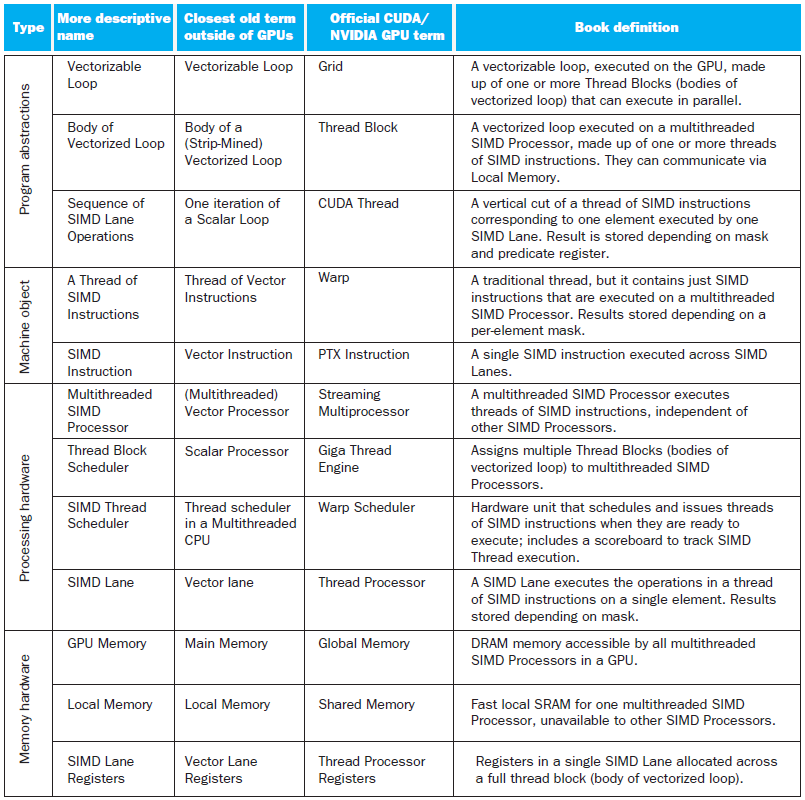

# Chapter 6

- [Chapter 1](CA_ch1.md)
- [Chapter 2](CA_ch2.md)
- [Chapter 3](CA_ch3.md)
- [Chapter 4](CA_ch4.md)
- [Chapter 5](CA_ch5.md)
- [Chapter 6](CA_ch6.md)

# Parallel Processors from Client to Cloud

## Introduction

## §6\.1 Introduction


* Goal: connecting multiple computersto get higher performance
  * Multiprocessors
  * Scalability\, availability\, power efficiency
* Task\-level \(process\-level\) parallelism
  * High throughput for independent jobs
* Parallel processing program
  * Single program run on multiple processors
* Multicore microprocessors
  * Chips with multiple processors \(cores\)

### Hardware and Software

- Hardware
  - Serial: e\.g\.\, Pentium 4
  - Parallel: e\.g\.\, quad\-core Xeon e5345
- Software
  - Sequential: e\.g\.\, matrix multiplication
  - Concurrent: e\.g\.\, operating system
- Sequential/concurrent software can run on serial/parallel hardware
  - Challenge: making effective use of parallel hardware

### What We’ve Already Covered

- §2\.11: Parallelism and Instructions
  - Synchronization
- §3\.6: Parallelism and Computer Arithmetic
  - Subword Parallelism
- §4\.11: Parallelism via Instructions
- §5\.10: Parallelism and Memory Hierarchies
  - Cache Coherence

### Parallel Programming

- Parallel software is the problem
- Need to get significant performance improvement
  - Otherwise\, just use a faster uniprocessor\, since it’s easier\!
- Difficulties
  - Partitioning
  - Coordination
  - Communications overhead

## §6\.2 The Difficulty of Creating Parallel Processing Programs

### Amdahl’s Law

- Sequential part can limit speedup
- Example: 100 processors\, 90× speedup?
  - Tnew = Tparallelizable/100 \+ Tsequential
  - Solving: Fparallelizable = 0\.999
- Need sequential part to be 0\.1% of original time

### Scaling Example

- Workload: sum of 10 scalars\, and 10 × 10 matrix sum
  - Speed up from 10 to 100 processors
- Single processor: Time = \(10 \+ 100\) × tadd
- 10 processors
  - Time = 10 × tadd \+ 100/10 × tadd = 20 × tadd
  - Speedup = 110/20 = 5\.5 \(55% of potential\)
- 100 processors
  - Time = 10 × tadd \+ 100/100 × tadd = 11 × tadd
  - Speedup = 110/11 = 10 \(10% of potential\)
- Assumes load can be balanced across processors

### Scaling Example (cont)

- What if matrix size is 100 × 100?
- Single processor: Time = \(10 \+ 10000\) × tadd
- 10 processors
  - Time = 10 × tadd \+ 10000/10 × tadd = 1010 × tadd
  - Speedup = 10010/1010 = 9\.9 \(99% of potential\)
- 100 processors
  - Time = 10 × tadd \+ 10000/100 × tadd = 110 × tadd
  - Speedup = 10010/110 = 91 \(91% of potential\)
- Assuming load balanced

### Strong vs Weak Scaling

- Strong scaling: problem size fixed
  - As in example
- Weak scaling: problem size proportional to number of processors
  - 10 processors\, 10 × 10 matrix
    - Time = 20 × tadd
  - 100 processors\, 32 × 32 matrix
    - Time = 10 × tadd \+ 1000/100 × tadd = 20 × tadd
  - Constant performance in this example

### Instruction and Data Streams

An alternate classification

|  |  | Data Streams |  |
| :-: | :-: | :-: | :-: |
|  |  | Single | Multiple |
| Instruction Streams | Single | __SISD__ :Intel Pentium 4 | __SIMD__ : SSE instructions of x86 |
|  | Multiple | __MISD__ :No examples today | __MIMD__ :Intel Xeon e5345 |

## §6\.3 SISD\, MIMD\, SIMD\, SPMD\, and Vector

- SPMD: Single Program Multiple Data
  - A parallel program on a MIMD computer
  - Conditional code for different processors

### Vector Processors

- Highly pipelined function units
- Stream data from/to vector registers to units
  - Data collected from memory into registers
  - Results stored from registers to memory
- Example: Vector extension to RISC\-V
  - v0 to v31: 32 × 64\-element registers\, \(64\-bit elements\)
  - Vector instructions
    - fld\.v\, fsd\.v: load/store vector
    - fadd\.d\.v: add vectors of double
    - fadd\.d\.vs: add scalar to each element of vector of double
- Significantly reduces instruction\-fetch bandwidth

### Example: DAXPY (Y = a × X + Y)

Conventional RISC\-V code:

```assembly
fld    f0, a(x3)     // load scalar a
addi   x5, x19, 512  // end of array X

loop: 
  fld    f1, 0(x19)    // load x[i]
  fmul.d f1, f1, f0    // a * x[i]
  fld    f2, 0(x20)    // load y[i]
  fadd.d f2, f2, f1    // a * x[i] + y[i]
  fsd    f2, 0(x20)    // store y[i]
  addi   x19, x19, 8   // increment index to x
  addi   x20, x20, 8   // increment index to y
  bltu   x19, x5, loop // repeat if not done

// Vector RISC-V code:
fld       f0, a(x3)    // load scalar a
fld.v     v0, 0(x19)   // load vector x
fmul.d.vs v0, v0, f0   // vector-scalar multiply
fld.v     v1, 0(x20)   // load vector y
fadd.d.v  v1, v1, v0   // vector-vector add
fsd.v     v1, 0(x20)   // store vector y
```

### Vector vs. Scalar

- Vector architectures and compilers
  - Simplify data\-parallel programming
  - Explicit statement of absence of loop\-carried dependences
    - Reduced checking in hardware
  - Regular access patterns benefit from interleaved and burst memory
  - Avoid control hazards by avoiding loops
- More general than ad\-hoc media extensions \(such as MMX\, SSE\)
  - Better match with compiler technology

### SIMD

- Operate elementwise on vectors of data
  - E\.g\.\, MMX and SSE instructions in x86
    - Multiple data elements in 128\-bit wide registers
- All processors execute the same instruction at the same time
  - Each with different data address\, etc\.
- Simplifies synchronization
- Reduced instruction control hardware
- Works best for highly data\-parallel applications

### Vector vs. Multimedia Extensions

Vector instructions have a variable vector width\, multimedia extensions have a fixed width

Vector instructions support strided access\, multimedia extensions do not

Vector units can be combination of pipelined and arrayed functional units:


### Multithreading

- Performing multiple threads of execution in parallel
  - Replicate registers\, PC\, etc\.
  - Fast switching between threads
- Fine\-grain multithreading
  - Switch threads after each cycle
  - Interleave instruction execution
  - If one thread stalls\, others are executed
- Coarse\-grain multithreading
  - Only switch on long stall \(e\.g\.\, L2\-cache miss\)
  - Simplifies hardware\, but doesn’t hide short stalls \(eg\, data hazards\)

## §6\.4 Hardware Multithreading

### Simultaneous Multithreading

- In multiple\-issue dynamically scheduled processor
  - Schedule instructions from multiple threads
  - Instructions from independent threads execute when function units are available
  - Within threads\, dependencies handled by scheduling and register renaming
- Example: Intel Pentium\-4 HT
  - Two threads: duplicated registers\, shared function units and caches

### Multithreading Example


### Future of Multithreading

- Will it survive? In what form?
- Power considerations  simplified microarchitectures
  - Simpler forms of multithreading
- Tolerating cache\-miss latency
  - Thread switch may be most effective
- Multiple simple cores might share resources more effectively

### Shared Memory

- SMP: shared memory multiprocessor
  - Hardware provides single physicaladdress space for all processors
  - Synchronize shared variables using locks
  - Memory access time
    - UMA \(uniform\) vs\. NUMA \(nonuniform\)

## §6\.5 Multicore and Other Shared Memory Multiprocessors


### Example: Sum Reduction

- Sum 64\,000 numbers on 64 processor UMA
  - Each processor has ID: 0 ≤ Pn ≤ 63
  - Partition 1000 numbers per processor
  - Initial summation on each processor
  - sum\[Pn\] = 0;  for \(i = 1000\*Pn;       i < 1000\*\(Pn\+1\); i \+= 1\)    sum\[Pn\] \+= A\[i\];
- Now need to add these partial sums
  - Reduction: divide and conquer
  - Half the processors add pairs\, then quarter\, …
  - Need to synchronize between reduction steps


half = 64;

do

<span style="color:#ff0000">synch\(\);</span>

if \(half%2 \!= 0 && Pn == 0\)

sum\[0\] \+= sum\[half\-1\];

/\* Conditional sum needed when half is odd;

Processor0 gets missing element \*/

half = half/2; /\* dividing line on who sums \*/

if \(Pn < half\) sum\[Pn\] \+= sum\[Pn\+half\];

while \(half > 1\);

### History of GPUs

- Early video cards
  - Frame buffer memory with address generation for video output
- 3D graphics processing
  - Originally high\-end computers \(e\.g\.\, SGI\)
  - Moore’s Law  lower cost\, higher density
  - 3D graphics cards for PCs and game consoles
- Graphics Processing Units
  - Processors oriented to 3D graphics tasks
  - Vertex/pixel processing\, shading\, texture mapping\,rasterization

## §6\.6 Introduction to Graphics Processing Units

### Graphics in the System


### GPU Architectures

- Processing is highly data\-parallel
  - GPUs are highly multithreaded
  - Use thread switching to hide memory latency
    - Less reliance on multi\-level caches
  - Graphics memory is wide and high\-bandwidth
- Trend toward general purpose GPUs
  - Heterogeneous CPU/GPU systems
  - CPU for sequential code\, GPU for parallel code
- Programming languages/APIs
  - DirectX\, OpenGL
  - C for Graphics \(Cg\)\, High Level Shader Language \(HLSL\)
  - Compute Unified Device Architecture \(CUDA\)

### Example: NVIDIA Tesla

Multiple SIMD processors\, each as shown:


- SIMD Processor: 16 SIMD lanes
- SIMD instruction
  - Operates on 32 element wide threads
  - Dynamically scheduled on 16\-wide processor over 2 cycles
- 32K x 32\-bit registers spread across lanes
  - 64 registers per thread context

### GPU Memory Structures


### Classifying GPUs

- Don’t fit nicely into SIMD/MIMD model
  - Conditional execution in a thread allows an illusion of MIMD
    - But with performance degredation
    - Need to write general purpose code with care

|  | Static: Discoveredat Compile Time | Dynamic: Discovered at Runtime |
| :-: | :-: | :-: |
| Instruction\-Level Parallelism | VLIW | Superscalar |
| Data\-Level Parallelism | SIMD or Vector | __Tesla Multiprocessor__ |

### Putting GPUs into Perspective

| Feature | Multicore with SIMD | GPU |
| :-: | :-: | :-: |
| SIMD processors | 8 to 24 | 15 to 80 |
| SIMD lanes/processor | 2 to 4 | 8 to 16 |
| Multithreading hardware support for SIMD threads | 2 to 4 | 16 to 32 |
| Typical ratio of single precision to double\-precision performance | 2:1 | 2:1 |
| Largest cache size | 48 MB | 6 MB |
| Size of memory address | 64\-bit | 64\-bit |
| Size of main memory | 64 GB to 1024 GB | 4 GB to 16 GB |
| Memory protection at level of page | Yes | Yes |
| Demand paging | Yes | No |
| Cache coherent | Yes | No |

### Guide to GPU Terms



### Message Passing

Each processor has private physical address space

Hardware sends/receives messages between processors

## §6\.8 Clusters\, WSC\, and Other Message\-Passing MPs


### Loosely Coupled Clusters

- Network of independent computers
  - Each has private memory and OS
  - Connected using I/O system
    - E\.g\.\, Ethernet/switch\, Internet
- Suitable for applications with independent tasks
  - Web servers\, databases\, simulations\, …
- High availability\, scalable\, affordable
- Problems
  - Administration cost \(prefer virtual machines\)
  - Low interconnect bandwidth
    - c\.f\. processor/memory bandwidth on an SMP

### Sum Reduction (Again)

- Sum 64\,000 on 64 processors
- First distribute 1000 numbers to each
  - The do partial sums
  - sum = 0;for \(i = 0; i<1000; i \+= 1\)  sum \+= AN\[i\];
- Reduction
  - Half the processors send\, other half receive and add
  - The quarter send\, quarter receive and add\, …

- Given send\(\) and receive\(\) operations
  - limit = 64; half = 64;/\* 64 processors \*/do  half = \(half\+1\)/2; /\* send vs\. receive                        dividing line \*/  if \(Pn >= half && Pn < limit\)     <span style="color:#ff0000">send\(Pn \- half\, sum\)</span> ;  if \(Pn < \(limit/2\)\)    sum \+=  <span style="color:#ff0000">receive\(\)</span> ;  limit = half; /\* upper limit of senders \*/while \(half > 1\); /\* exit with final sum \*/
  - Send/receive also provide synchronization
  - Assumes send/receive take similar time to addition

### Grid Computing

- Separate computers interconnected by long\-haul networks
  - E\.g\.\, Internet connections
  - Work units farmed out\, results sent back
- Can make use of idle time on PCs
  - E\.g\.\, SETI@home\, World Community Grid

### Interconnection Networks

- Network topologies
  - Arrangements of processors\, switches\, and links


## §6\.9 Introduction to Multiprocessor Network Topologies


### Multistage Networks


### Network Characteristics

- Performance
  - Latency per message \(unloaded network\)
  - Throughput
    - Link bandwidth
    - Total network bandwidth
    - Bisection bandwidth
  - Congestion delays \(depending on traffic\)
- Cost
- Power
- Routability in silicon

### Parallel Benchmarks

- Linpack: matrix linear algebra
- SPECrate: parallel run of SPEC CPU programs
  - Job\-level parallelism
- SPLASH: Stanford Parallel Applications for Shared Memory
  - Mix of kernels and applications\, strong scaling
- NAS \(NASA Advanced Supercomputing\) suite
  - computational fluid dynamics kernels
- PARSEC \(Princeton Application Repository for Shared Memory Computers\) suite
  - Multithreaded applications using Pthreads and OpenMP

## §6\.11 Multiprocessor Benchmarks and Performance Models

### Code or Applications?

- Traditional benchmarks
  - Fixed code and data sets
- Parallel programming is evolving
  - Should algorithms\, programming languages\, and tools be part of the system?
  - Compare systems\, provided they implement a given application
  - E\.g\.\, Linpack\, Berkeley Design Patterns
- Would foster innovation in approaches to parallelism

### Modeling Performance

- Assume performance metric of interest is achievable GFLOPs/sec
  - Measured using computational kernels from Berkeley Design Patterns
- Arithmetic intensity of a kernel
  - FLOPs per byte of memory accessed
- For a given computer\, determine
  - Peak GFLOPS \(from data sheet\)
  - Peak memory bytes/sec \(using Stream benchmark\)

### Roofline Diagram


Attainable GPLOPs/sec

= Max \( Peak Memory BW × Arithmetic Intensity\, Peak FP Performance \)


Attainable GPLOPs/sec

= Max \( Peak Memory BW × Arithmetic Intensity\, Peak FP Performance \)

### Comparing Systems

- Example: Opteron X2 vs\. Opteron X4
  - 2\-core vs\. 4\-core\, 2× FP performance/core\, 2\.2GHz vs\. 2\.3GHz
  - Same memory system


- To get higher performance on X4 than X2
  - Need high arithmetic intensity
  - Or working set must fit in X4’s 2MB L\-3 cache

### Optimizing Performance

- Optimize FP performance
  - Balance adds & multiplies
  - Improve superscalar ILP and use of SIMD instructions
- Optimize memory usage
  - Software prefetch
    - Avoid load stalls
  - Memory affinity
    - Avoid non\-local data accesses


Choice of optimization depends on arithmetic intensity of code


- Arithmetic intensity is not always fixed
  - May scale with problem size
  - Caching reduces memory accesses
    - Increases arithmetic intensity

### TPUv3 vs Volta for DNN


### TPUv3

- Core Sequencer:
  - VLIW with software\-managed memory
    - 322\-bit VLIW w/8 operations:
      - 2 x scalar ALU\, 2 x vector ALU\, vector load and store\, 2 x queue operations for matrix multiply/transpose unit


- Vector Processing Unit \(VPU\)
  - Uses data\-level parallelism \(2D matrix and vector functional units\) and instruction\-level parallelism \(8 operations per instruction\)
  - Uses on\-chip vector memory \(Vmem\) with 32K 128 x 32\-bit elements \(16 MiB\)
  - 32 2D vector registers \(Vregs\) that each contain 128 x 8 32\-bit elements \(4 KiB\)
- MXU
  - Produces 32\-bit FP products from 16\-bit FP inputs that accumulate in 32 bits
  - Two MXUs per TensorCore
- The Transpose Reduction Permute Unit
  - 128x128 matrix transposes\, reductions\, and permutations

### TPUv3 vs Volta for DNN


### Speedup of TPUv3 vs Volta


### TPUv3 and Volta Scalability


### Multi-threading DGEMM

Use OpenMP:

1\. \#include \<x86intrin\.h>

2\. \#define UNROLL \(4\)

3\. \#define BLOCKSIZE 32

4\. void do\_block \(int n\, int si\, int sj\, int sk\,

5\.                double \*A\, double \*B\, double \*C\)

6\. \{

7\.   for \( int i = si; i < si\+BLOCKSIZE; i\+=UNROLL\*8 \)

8\.     for \( int j = sj; j < sj\+BLOCKSIZE; j\+\+ \) \{

9\.       \_\_m512d c\[UNROLL\];

10\.       for \(int r=0;r<UNROLL;r\+\+\)

11\.         c\[r\] =  \_mm512\_load\_pd\(C\+i\+r\*8\+j\*n\); //\[ UNROLL\];

12\.

13\.       for\( int k = sk; k < sk\+BLOCKSIZE; k\+\+ \)

14\.       \{

15\.         \_\_m512d bb = \_mm512\_broadcastsd\_pd\(\_mm\_load\_sd\(B\+j\*n\+k\)\);

16\.         for \(int r=0;r<UNROLL;r\+\+\)

17\.           c\[r\] = \_mm512\_fmadd\_pd\(\_mm512\_load\_pd\(A\+n\*k\+r\*8\+i\)\, bb\, c\[r\]\);

18\.        \}

19\.

20\.      for \(int r=0;r<UNROLL;r\+\+\)

21\.        \_mm512\_store\_pd\(C\+i\+r\*8\+j\*n\, c\[r\]\);

22\.      \}

23\.   \}

24\.

25\. void dgemm \(int n\, double\* A\, double\* B\, double\* C\)

26\. \{

27\. \#pragma omp parallel for

28\.   for \( int sj = 0; sj < n; sj \+= BLOCKSIZE \)

29\.     for \( int si = 0; si < n; si \+= BLOCKSIZE \)

30\.       for \( int sk = 0; sk < n; sk \+= BLOCKSIZE \)

31\.         do\_block\(n\, si\, sj\, sk\, A\, B\, C\);

32\. \}

## §6\.13 Going Faster:  Multiple Processors and Matrix Multiply

### Multithreaded DGEMM


### Fallacies

- Amdahl’s Law doesn’t apply to parallel computers
  - Since we can achieve linear speedup
  - But only on applications with weak scaling
- Peak performance tracks observed performance
  - Marketers like this approach\!
  - But compare Xeon with others in example
  - Need to be aware of bottlenecks

## §6\.14 Fallacies and Pitfalls

- Not developing the software to take advantage of\, or optimize for\, a novel architecture
  - Unexpected bottlenecks\, e\.g\. serialization of page tables
  - Usability for DSAs
- You can get good vector performance without proving memory bandwidth
  - Beware of the sloping part of the roofline

### Pitfalls

- Not developing the software to take account of a multiprocessor architecture
  - Example: using a single lock for a shared composite resource
    - Serializes accesses\, even if they could be done in parallel
    - Use finer\-granularity locking

- Assuming the ISA completely hides the physical implementation properties
  - Attacker can examine state changes caused by instructions that are rolled back or performance differences caused by intermixing of instructions from different programs on the same server
    - Speculation
    - Caching
    - Hardware multithreading


### Concluding Remarks


* Goal: higher performance by using multiple processors
* Difficulties
  * Developing parallel software
  * Devising appropriate architectures
* SaaS importance is growing and clusters are a good match
* Performance per dollar and performance per Joule drive both mobile and WSC


## §6\.15 Concluding Remarks


### Concluding Remarks (con’t)

SIMD and vector operations match multimedia applications and are easy to program


